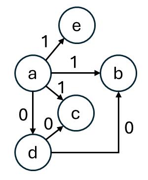

## 介紹

適用於圖中所有邊的權重只有 0 / 1 兩種值時。求原點到目標點的最短距離。

<table>
<tr>
<td valign="top">
以右圖為例，從 $a$ 出發，第一步展開，來到各自點的距離如下：

$$
\begin{array}{cccc}
a & b & c & d & e \\\hline
0 & 1 & 1 & 0 & 1
\end{array}
$$

而在第二層展開時，發現 $a\to{d}\to{b}$ 的路徑要比原先更好。\
不用傳統 `bfs` 的方法的原因就在這，\
展開次數跟最短路徑此時不掛勾，也就無法以它判斷距離。

</td>
<td width="23%">

</td>
</tr>
</table>

---

傳統的bfs每次展開，距離都會逐漸增大，滿足兩個條件：

- 隊列中的元素單調遞增。
- 隊列中的元素差值至多為 1。

也就是說，隊列中的元素是 $[d,d,d+1,d+1,\dots]$ 的形式。\
每次我們都能取得最短距離的元素 $d$ ，並以它展開到附近的鄰居，\
而鄰居對應到的距離就是 $d+1$ ，而它會被放到隊伍的尾端。\
因此上面描述的情況總是成立。

---

現在展開的次數跟最短路徑不掛勾，但因為邊權只有兩種可能，0 和 1，\
因此我們能用雙端隊列，讓它變得掛勾。\
具體來說，就是讓隊列中的元素，滿足上述兩個條件，就能正確求出最短路徑了。

演算法流程

1. 創建一個 `distance` 陣列，代表與各自節點的距離，初始化為無限大。
2. `distance[原點] = 0`，創建一個雙端隊列 $dq$ ，並將原點加入。
3. 彈出 $dq$ 頂部元素 $x$

- 如果 $x$ 是目標點，回傳 $distance[x]$ 表示原點到目標點的最短距離。
- 否則，檢查從 $x$ 出發的每一條邊，鄰居節點 $y$ ， $x\overset{w}\to{y}$ 。
  - 如果 $distance[y] > distance[x] + w$ ，也就是新路徑比較近時，處理該邊。
  - 處理時，更新 $distance[y] = distance[x] + w$
    - $x=0$ ， $y$ 從頭部進入 $dq$ 。
    - $x=1$ ， $y$ 從尾部進入 $dq$ 。

4. 重複第三步，直到 $dq$ 為空。

以上面例子來說：最初 $distance = \{0,\infty,\infty,\infty,\infty\}$ ， $dq=\{0\}$ 。

- 展開周圍的邊，更新 $distance$
  - $distance=\{0,1,1,0,1\}$ ，$dq=\begin{cases}0,1,1,1 \\d,b,c,e\end{cases}$
- 取得 $dq$ 的頭 $\{d,0\}$ 展開周圍的邊，更新 $distance$
  - 找到 $b$ 更短的路徑， $c$ 的路徑長也更短，加入頂端。
  - $distance=\{0,0,0,0,1\}$ ，$$dq=\begin{cases}
0, 0, 1, 1, 1\\
c, b, b, c, e
\end{cases}$$

- 取得 $dq$ 的頭 $\{c,0\}$ 展開周圍的邊，更新 $distance$
  - 沒有相鄰的邊，沒有任何更新

- 之後取得的所有元素，都沒有任何更新。

最後 $distance=\{0,0,0,0,1\}$ ，找到了來到所有點的最短距離。\
不需要標記那些節點有被走訪過，因為一個點最多只會被修正一次。\
也就是 $distance[i]=d+1\to{d}$ 的情況，\
後續就算再次走訪，也不會有更短的路徑，不會再被擴展。

---

為什麼這樣做可以滿足上述兩個條件？

- 在經過權重 0 來到 $y$ 時， $distance[y]=d+0=d$\
  這時應將 $y$ 放到隊首，因為要保證 $[d,d,\dots, d, d+1,d+1]$ 的單調性。
- 經過權重 1 來到 $y$ ， $distance[y] = d + 1$\
  這時應將 $y$ 放到隊尾。\
  之所以差值不會超過 $1$ ，是因為邊權只有 0 或 1。如果存在權重 2 的邊，就會從 $d$ 更新出 $d+2$ ，隊列中就會出現三種元素 $\{d,d+1,d+2\}$ ，差值就會變成 $2$ 。\
  上述的構造方法，確保了 $dq$ 滿足兩個條件。
