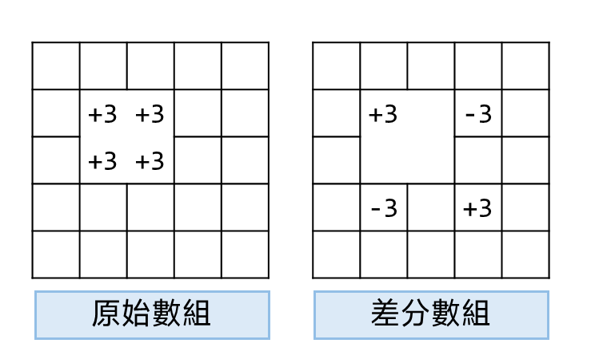
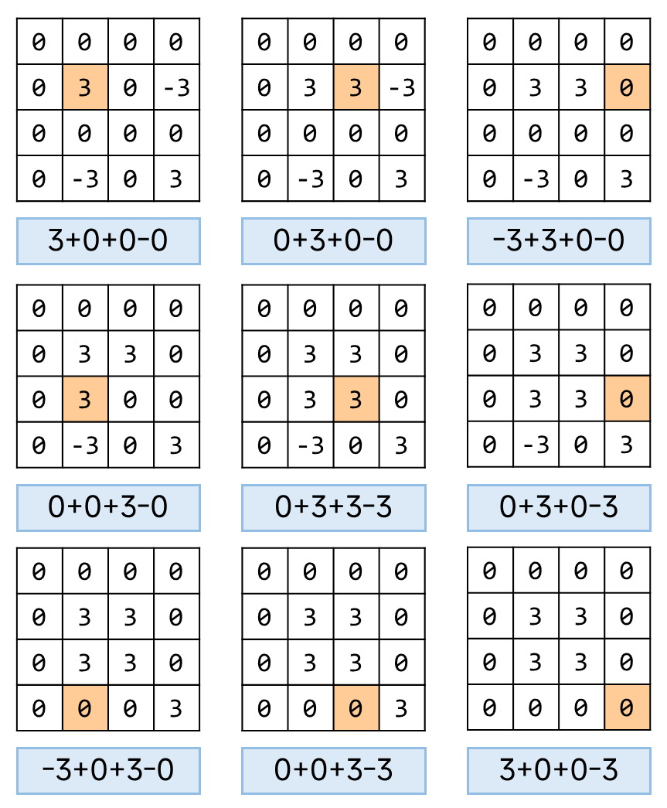

## 介紹
二維差分數組跟一維相同，能快速的把「範圍」的操作簡化為幾個數值的操作。

依舊跟前綴和是對應的，套用差分之後的數組，想要變回來，就用前綴和找。

---

若原先陣列的某個區域固定加 $3$ 。

差分數組要在做前綴合之後，變成原本的數組，因此最後差分數組的變化如下。

<table>
<tr>
<td valign="top" width="60%">

- 原先數組：
$
\begin{bmatrix}
0 & 0 & 0 & 0\\
0 & 0 & 0 & 0\\
0 & 0 & 0 & 0\\
0 & 0 & 0 & 0\\
\end{bmatrix}
\to
\begin{bmatrix}
0 & 0 & 0 & 0\\
0 & 3 & 3 & 0\\
0 & 3 & 3 & 0\\
0 & 0 & 0 & 0\\
\end{bmatrix}
$

- 差分數組：
$
\begin{bmatrix}
0 & 0 & 0 & 0\\
0 & 0 & 0 & 0\\
0 & 0 & 0 & 0\\
0 & 0 & 0 & 0\\
\end{bmatrix}
\to
\begin{bmatrix}
0 & 0 & 0 & 0\\
0 & +3 & 0 & -3\\
0 & 0 & 0 & 0\\
0 & -3 & 0 & +3\\
\end{bmatrix}
$
</td>
<td>

</td>
</tr>
</table>

我們修改的區域左上在 $(1,1)$ ，右下在 $(2,2)$ ，在差分數組當中，修改到的位置則是 $(1,1),(1,3),(3,1),(3,3)$ 

跟前綴和修改的位置是有所對應的，至於為什麼是這樣改，見下面的詳細步驟。

<table>
<tr>
<td valign="top" width="56%">

對差分數組
$
\begin{bmatrix}
0 & 0 & 0 & 0\\
0 & +3 & 0 & -3\\
0 & 0 & 0 & 0\\
0 & -3 & 0 & +3\\
\end{bmatrix}
$
做前綴合，從 $(1,1)$ 開始。
　　每次操作都是當前的數值，減去左邊，減去上面，加回左上角，將結果填回矩陣當中。

　　操作會把數字的影響不斷往下帶，因此在遇到更新的範圍邊界時，要把影響抵銷掉，這就是為什麼會有兩個 $-3$ 出現在兩個邊界上，而右下角會受到兩次 $-3$ 影響，被額外扣除一次，因此要加回來補正。

---

　　實際的差分數組會額外加入一圈0，跟前綴合是同樣的道理，這樣就不需要額外去判斷左，上，左上存不存在。

　　至於為什麼要在右跟下也補 $0$ ，是因為操作 $(x,y)\sim(i, j)$ 區域的時候，差分數組最多會到 $(i+1,j+1)$ 
</td>
<td>

</td>
</tr>
</table>

