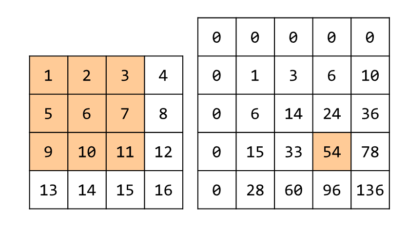
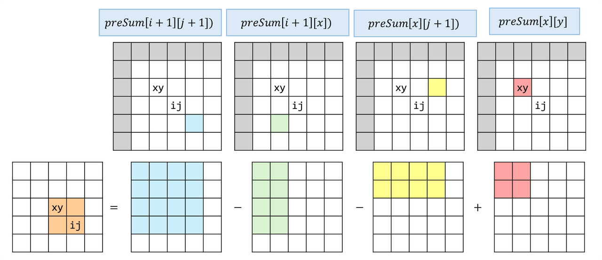

## 介紹
<table>
<tr>
<td valign="top" width="60%">

將前綴和進化成二維，如右圖所示，\
會加入 0 的關係也是為了計算方便而做的。\
格子 $\text{prefixSum[i][j]}$ 紀錄的數值，\
代表以 $(0,0)$ 為左上， $(i-1,j-1)$ 為右下角的矩形區域總和。\
這樣就能在預處理後，\
用 $O(1)$ 的速度查找任意二維數組的區域面積，公式如圖所示
</td>
<td>

</td>
</tr>
</table>

