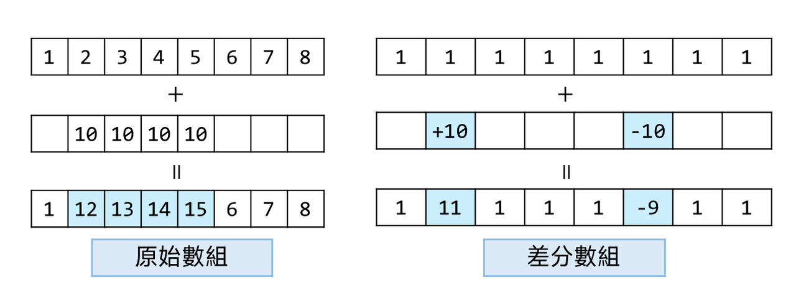

## 介紹
給定一個數組 $[1,2,3,4,5,6,7,8]$ ，給定左右邊界 $L,R$ ，
多次將範圍內的元素整體加一固定的數字，要求每次修改的時間複雜度 $O(1)$ 。
比如 $L=1,R=2$ 的，加上 $10$ ，改變後的數組就是 $[1,12,13,\dots]$ 。

差分數組的作用就是能做到「範圍操作」，將一個數組做差分之後，紀錄的數值是每個數字之間的差，

對這個數組做前綴和就能還原成原本的數組，此時如果想要讓範圍內的數字增加十，就將起點位置的數值減去10，結束位置的下一格減10。

相當於在某個地方先抬升，到達目的地之後再降回來，區間內的所有數字都會受到抬升的影響。

差分數組大多時候只能在所有操作都完成之後才去查詢，不支援邊做邊查最後結果。

