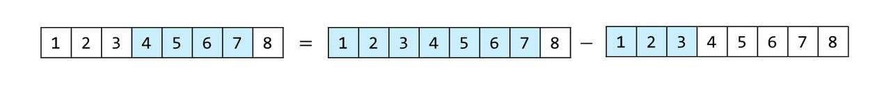

## 介紹
給定一個數組 $[1,2,3,4,5,6,7,8]$ ，給定左右邊界 $L,R$ ，\
多次求範圍內的元素和，要求每次求和的時間複雜度 $O(1)$ 。\
如果要求 $L=1,R=2$ 的 $sum(L,R)$ ，答案就是 $2+3=5$ 。

---

數字 $L,R$ 範圍的累加和可以視作 $sum(0\sim{R})$ 減去 $sum(0\sim{L})$ 的答案。

我們可以先算好 $sum(0\sim{x})$ 的所有答案，並事先存到陣列當中，這個陣列就叫做前綴和數組，

以上面的數組為例， $[1,2,3,4,5,6,7,8]$ 的前綴和 $\text{prefixSum}=[1,3,6,10,15,21,28,36]$ 。

在求 $sum(1,2)$ 時： $\text{prefixSum}[2]-\text{prefixSum}[\orange{0}]=3$ 。

這樣做有一個問題，在左邊界為 $0$ 的時候，`index`會越界到`-1`，需要特別判斷。

為了簡化邏輯，通常會在前面多加一個 $0$ ，也就是 $\text{prefixSum}=[0,1,3,\dots]$ 方便計算，

這時想要求 $sum(1,2)$ ，算式就要改成 $\text{prefixSum}[\orange3]-\text{prefixSum}[1]$ 。