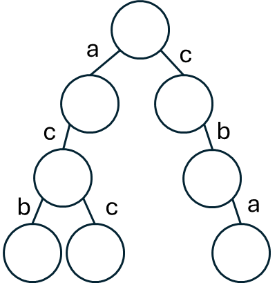
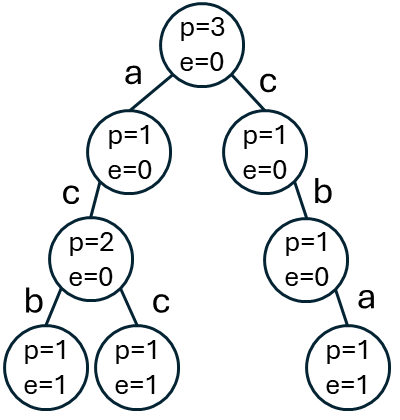
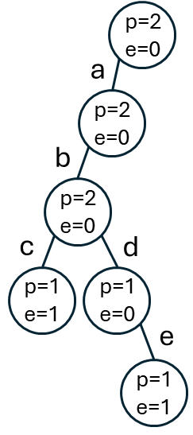
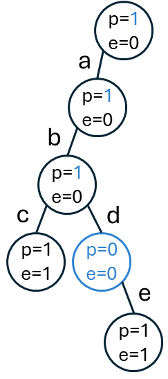

## 介紹
<table>
<tr>
<td valign="top" width="74%">

前綴樹顧名思義，把前綴相同的東西合併到一起，有效率的使用儲存空間。\
以右圖為例，假設現在要儲存`acb`、`cba`、`acc`三個字串。
1. `acb`：最初只有根結點，因此建立出最左邊的這一條路。
2. `cba`：第一個字元不存在，新建節點連上根，往下建出另一條路。
3. `acc`：前兩個字元前面有建立過，重複利用，最後分岔出一條路。

此時加入`ac`字串的話，要怎麼知道在葉節點之前就結束了？
</td>
<td>


</td>
</tr>
</table>

<table>
<tr>
<td valign="top" width="75%">

因此，每個節點上會有額外的資訊，在建立前綴樹時，記錄`pass`和`end`。
- `pass`：紀錄某個節點被經過了幾次。
- `end`：紀錄此節點作為終點的次數有多少。

加入`acb`、`cba`、`acc`三個字串後，前綴樹每個節點紀錄的資訊如右。\
最後加入`ac`字串時，就把`acb`路上遇到的`c`節點的`end`變數+1。
</td>
<td>


</td>
</tr>
</table>

## 與哈希表的不同

前綴樹跟哈希表的不同在於，在「前綴」相關的查找比較有優勢。\
每次插入都會經過根結點，所以根結點的`pass`變數，記錄著整棵樹有多少字串，\
也代表「前綴為空字串的字串數量」。\
這時我想找以`ac`為前綴的字串有幾個，往左走兩步之後來到`c`節點，\
節點`pass`變數是2，表示有兩個單字，（`ac`、`acc`）\
也因此，在題目要根據前綴查找具體有哪些單字時，用前綴樹就要比哈希表好。\
若單純要計算同樣前綴有多少單字，用哈希表就行。\
缺點是比較浪費空間，和總字元數量，以及字元的種類有關。

## 基本實現
### 前綴樹的基本操作
1. `insert(string)`：插入字串。
2. `search(string)`：判斷字串出現了幾次。
    - 作為後續兩個操作的輔助方法。
3. `prefixNumber(string)`：以該字串為前綴的字串有多少。
4. `delete(string)`：刪除字串。
<table>
<tr>
<td valign="top">

- 要先判斷是否存在，再去做刪除。過程將經過節點的`pass`變數減一。
- 若節點的`pass`變數減成0，則<span style="color:var(--color-accent-fg)">該節點之後的所有節點都可以刪了。</span>\
  比如插入`abc`、`abde`，刪除`abde`的時候，因為節點`d`的`pass`會歸零，代表現在刪除的，是當前前綴`abd`的最後一個節點。\
  也就可以直接移除節點`b`往`d`的路徑了。
</td>
<td width="15%">


</td>
<td width="15%">


</td>
</tr>
</table>

<span style="color:var(--color-accent-fg)">※ 當放入的字元不僅限於小寫字母的時候，與其用陣列存放，用哈希表紀錄要更省空間。</span>

### 題目
- [1804. 實現 Trie](https://leetcode.com/problems/implement-trie-ii-prefix-tree/)
- [字典樹的實現](https://www.nowcoder.com/practice/7f8a8553ddbf4eaab749ec988726702b)

### 類別的實作方式
- `insert(string)`：插入字串時，從根結點往下走，當有路通行時走老路，無路通行就開拓。
- `search(string)`：跟插入字串類似，不過無路通行時代表查找字串不存在，走到底回傳當前節點的`end`。
- `delete(string)`：先判斷字串是否存在，減去下個節點的`pass`變數，如果歸零，代表刪的是當前前綴的最後一個字串，即將前往的這條路也就沒有意義了。
- `prefixNum(string)`：同`search`，不過走道底時回傳當前節點的`pass`。
```cpp
#include <iostream>
#include <array>
#include <vector>
using namespace std;
struct TrieNode {
    int pass;
    int end;
    array<TrieNode*, 26> nexts; // 當不只有小寫字母的時候，用哈希表
    TrieNode() : pass(0), end(0), nexts{nullptr} { }
};
class Trie {
private:
    TrieNode* root;
public:
    Trie() {
        root = new TrieNode();
    }
    // 插入新的字串
    void insert(string s) {
        TrieNode* node = root;
        root->pass++;
        for(char ch : s) {
            int path = ch - 'a';
            if(node->nexts[path] == nullptr) { // 還沒創建過這條路
                node->nexts[path] = new TrieNode();
            }
            node = node->nexts[path];
            node->pass++;
        }
        // 走到終點
        node->end++;
    }
    // 查詢前綴樹當中，字串 s 出現了幾次
    int search(string s) { 
        TrieNode* node = root;
        for(char ch : s) {
            int path = ch - 'a';
            if(node->nexts[path] == nullptr) {
                return 0;
            }
            node = node->nexts[path];
        }
        // 走到終點
        return node->end;
    }
    // 找出前綴樹當中以單字 s 為前綴的單字，一共有多少個
    int prefixNum(string s) {
        TrieNode* node = root;
        for(char ch : s) {
            int path = ch - 'a';
            if(node->nexts[path] == nullptr) {
                return 0;
            }
            node = node->nexts[path];
        }
        return node->pass;
    }
    // 將字串 s 從前綴樹刪除
    void remove(string s) { // C++ 不能用 delete 作為函數名稱
        if(search(s) == 0) return; // 確保字串存在
        TrieNode* node = root;
        node->pass--;
        for(char ch : s) {
            int path = ch - 'a';
            if(--node->nexts[path]->pass == 0) { // 刪除的字串，是某個前綴的最後一個單字，這個子樹就整個刪掉了
                delete node->nexts[path]; // 釋放空間，但不多
                node->nexts[path] = nullptr;
                cout << "斷開整個子樹，當前節點" << ch << endl; 
                return;
            }
            node = node->nexts[path];
        }
        node->end--;
    }
};
int main(void) {
    Trie trie;
    trie.insert("abc");
    trie.insert("abcde");
    trie.remove("abcde");
}
```
### 靜態數組的實作方式
相比類別，一次性準備好會用到的空間，速度要快的多。
建立一個二維陣列`trie`，`trie[i][j]`相當於節點`i`的`nexts`陣列（類別實現當中的`nexts`）。
假如現在只會出現`abc`三種字元，最多 $n$ 個節點，`trie[n+1][3]`就是最初宣告的大小。（`trie[0]`不使用）
並建立`pass[n + 1]`，`end[n + 1]`陣列，

---

根節點為編號`trie[1]`的內容，初始值 $[0,0,0]$ ，就是類別實現的`nexts`陣列。
建立一個變數`cnt`，代表當前尚未使用的節點編號，初始值 2。
1. 現在加入第一個字串`acb`。
- 查看根節點的對應的`nexts`陣列，發現 $a$ 對應數值是代表不存在的 $0$ ，需要創建新節點。
  - 創建新節點，位置在`cnt = 2`， $\text{trie}[1]=[2,0,0]$ ，`++cnt` 。
  -  $\text{pass}[1]=1$ ， $\text{end}[1]=0$ 
- 來到新的節點 $\text{trie}[2]=[0,0,0]$ ， $c$ 對應的數值是 $0$ ，需要創建新節點。
  - 創建新節點，位置在`cnt = 3`， $\text{trie}[2] = [0,0,3]$ ，`++cnt`。
  -  $\text{pass}[2] = 1$ ， $\text{end}[2] = 0$ 
- 來到新的節點 $\text{trie}[3]=[0,0,0]$ ， $b$ 對應的數值是 $0$ ，需要創建新節點。
  - 創建新節點，位置在`cnt = 4`， $\text{trie}[3] = [0,4,0]$ ，`++cnt`。
  -  $\text{pass}[3]=1$ ， $\text{end}[3]=0$ 
- 來到最終節點 $\text{trie}[4] = [0,0,0]$ 。
  -  $\text{pass}[4]=1$ ， $\text{end}[4]=1$ 
2. 第二個字串`ab`。
- 根節點的 $a$ 存在數值 $2$ ，所以跳到舊有節點 $\text{trie}[2]$ 
  -  $\text{pass}[1]=2$ ， $\text{end}[1]=0$ ，`cnt`不變。
-  $\text{trie}[2]=[0,0,3]$ ，沒有對應 $b$ 的節點，創建新節點
    - 位置在`cnt = 5`， $\text{trie}[2] = [0, 5, 3]$ 。
    -  $\text{pass}[2]=2$ ， $\text{end}[2]=0$ 
- 來到最終節點 $\text{trie}[5]=[0,0,0]$ 。
    -  $\text{pass}[5]=1$ ， $\text{end}[5]=1$ 
```cpp
#include <iostream>
using namespace std;
const int MX = 150001;
int trie[MX][26]{};
int pass[MX];
int End[MX];
int cnt;

void insert(string s) {
    int cur = 1;
    pass[cur]++;
    for(char ch : s) {
        int path = ch - 'a';
        if(trie[cur][path] == 0) { // 判斷是否存在
            trie[cur][path] = cnt++; // 創建新節點
        }
        cur = trie[cur][path]; // 來到新節點
        pass[cur]++;
    }
    End[cur]++;
}
bool search(string s) {
    int cur = 1;
    for(char ch : s) {
        int path = ch - 'a';
        if(trie[cur][path] == 0) { // 沒有當前字元的路徑
            return false;
        }
        cur = trie[cur][path];
    }
    return End[cur] >= 1;
}
int prefixNumber(string s) {
    int cur = 1;
    for(char ch : s) {
        int path = ch - 'a';
        if(trie[cur][path] == 0) {
            return 0;
        }
        cur = trie[cur][path];
    }
    return pass[cur];
}
void remove(string s) {
    if(!search(s)) return;
    int cur = 1;
    for(char ch : s) {
        int path = ch - 'a';
        if(--pass[trie[cur][path]] == 0) { // 現在刪掉的是當前前綴的最後一個單字
            trie[cur][path] = 0;
        }
        cur = trie[cur][path];
    }
    End[cur]--;
}
int main() {
    ios::sync_with_stdio(false);
    cin.tie(nullptr);
    int m, op;
    string s;
    cin >> m;
    cnt = 2;
    while(m--) {
        cin >> op >> s;
        switch(op) {
            case 1: insert(s); break;
            case 2: remove(s); break;
            case 3: cout << (search(s) == true ? "YES" : "NO") << endl; break;
            case 4: cout << prefixNumber(s) << endl; break;
            default: cout << "impossible!\n";
        }
    }
}
/*
op = 1, void insert 
op = 2, void delete
op = 3, bool search
op = 4, int prefixNumber
*/
```