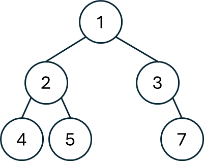

## 思路
給定二叉樹先序（或是後序）跟中序，還原出一開始二叉樹的樣子。\
先序會給定`[中左右]`，而中序是`[左中右]`\
一開始的根結點能透過先序來得到中，\
接下來要判斷左右各自有多長，這要看中序遍歷要幾步才會到剛才找到的根結點中。

---

<table>
<tr>
<td width="70%">

舉例來說，右圖的樹轉換成前序跟中序如下\
前序：$[1,2,4,5,3,7]$ \
中序：$[4,2,5,1,3,7]$ \
先看前序的第一個數字`1`，因此根結點是`1`。\
再看中序`1`前面的數字，得知 $[4,2,5]$ 都是左樹內容。\
也就知道剩下的 $[3,7]$ 是右樹了。\
再對找出來的左樹跟右樹做相同的操作，就能知道所有節點的位置。

</td>
<td valign="top">


</td>
</tr>
</table>

## 程式碼
### dfs
```cpp
class Solution {
public:
    TreeNode* buildTree(vector<int>& preorder, vector<int>& inorder) {
        unordered_map<int, int> umap; // inorder 當中數字所在的位置。        
        int n = preorder.size(), m = inorder.size();
        for(int i = 0; i < m; ++i) {
            umap[inorder[i]] = i;
        }
        auto dfs = [&](this auto&&dfs, int l1, int r1, int l2, int r2) -> TreeNode* {
            if(l1 > r1) return nullptr;
            TreeNode* head = new TreeNode(preorder[l1]);
            if(l1 == r1) return head;
            int pos = umap[preorder[l1]];
            head->left = dfs(l1 + 1, l1 + pos - l2, l2, pos - 1);
            head->right = dfs(l1 + pos - l2 + 1, r1, pos + 1, r2);
            return head;
        };
        return dfs(0, n - 1, 0, m - 1);
    }
};
/*
左中右
中左右
*/
```
## 複雜度分析
- 時間複雜度：$O(n)$
- 空間複雜度：$O(n)$

