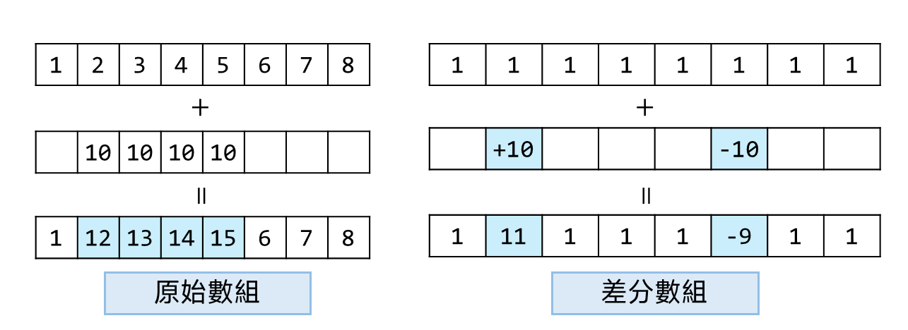

## 思路
基本題目，差分數組 + 前綴和。

題目會給定一系列的範圍，以及這個時間訂位的乘客數量，
創建一個大小為 $n$ ，如果每次從 first 遍歷到 last，最差情況會是 $O(n^2)$，
題目的資料量 $(2\times10^4)^2 = 4\times10^8$ 會超時。

---

### 差分數組介紹 
給定一個數組 $[1,2,3,4,5,6,7,8]$，給定左右邊界 $L,R$，\
多次將範圍內的元素整體加一固定的數字，要求每次修改的時間複雜度 $O(1)$。\
比如 $L=1,R=2$的，加上 $10$，改變後的數組就是 $[1,12,13,\dots]$



<span style="margin-left: 2rem"> </span>
差分數組的作用就是能做到「範圍操作」，將一個數組做差分之後，紀錄的數值是每個數字之間的差，對這個數組做前綴和就能還原成原本的數組，此時如果想要讓範圍內的數字增加10，就將起點位置的數值減去10，結束位置的下一格減10。相當於在某個地方先抬升，到達目的地之後再降回來，區間內的所有數字都會受到抬升的影響。

---

此題完美符合上述的使用情況，每次將 `first ~ last` 之間的數值增加 `seat`。\
因此套用上面圖示的操作，需要注意輸入範圍在 $1\sim{n}$。

## 程式碼
```cpp
class Solution {
public:
    vector<int> corpFlightBookings(vector<vector<int>>& bookings, int n) {
        vector<int> res(n + 1);
        for(auto& b : bookings) {
            int first = b[0], last = b[1], seat = b[2];
            res[first - 1] += seat; // 1 <= first, last <= n
            res[last] -= seat;
        }
        for(int i = 1; i < n; ++i) {
            res[i] = res[i] + res[i - 1];
        }
        res.pop_back();
        return res;
    }
};
```
## 複雜度分析
- 時間複雜度：$O(n)$
- 空間複雜度：$O(n)$
