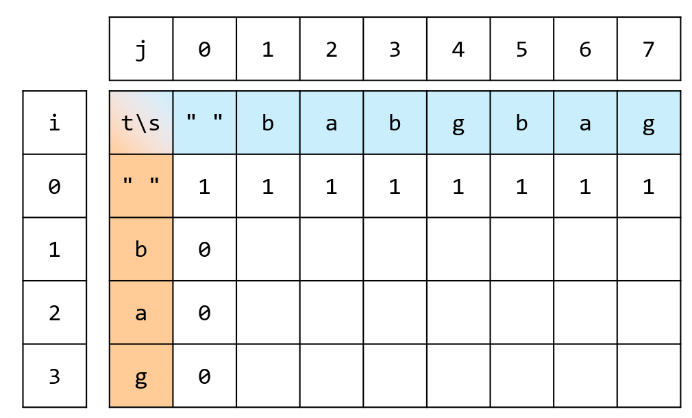
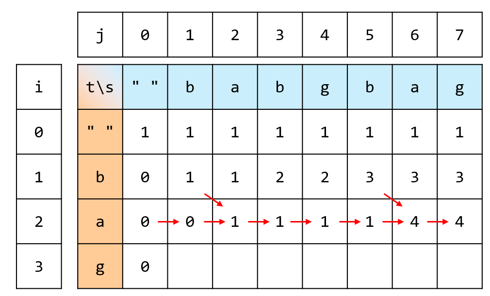

## 思路

定義`dp[len1][len2]=s[0...len1-1]`的子序列在`t[0...len2-1]`出現的個數。

- `dp[0][0] = 1`，因為兩個字串都是空的。
- `∀j > 0, dp[0][j] = 0`，因為字串`t[0...j-1]`不會出現在空字串中。
- `∀i > 0, dp[i][0] = 1`，因為空字串算一個。

<table>
<tr>
<td valign="top" width="48%">



<p style="text-align:center;">dp 表初始化</p>

</td>
<td></td>
<td valign="top" width="48%">



<p style="text-align:center;">dp 表更新過程</p>

</td>
</tr>
</table>

初始化完成後，更新`dp`表。

- 想知道`dp[i][j]`。
  - 既然在更短的`t[0...j-2]`能找到一個子序列，那麼在`t[0...j-1]`當然也能找到這個子序列。\
    所以答案必定包含`dp[i][j-1]`。
  - 如果`s[j-1] == t[i-1]`（注意`i`, `j`是長度），那麼這兩個字元可以作為最後一個字元，\
    接上`dp[i-1][j-1]`對應的那些子序列。

## 程式碼

### 1. 動態規劃 遞推

```cpp
class Solution {
private:
    static const int MX = 1001;
    unsigned int dp[MX][MX]; // 題目保證最後答案在 32 位元內，但不保證中間會出事。用 unsigned 避免報錯
public:
    int numDistinct(string s, string t) {
        // dp[len1][len2] = s[0...len1-1] 的子序列在 t[0...len2-1] 出現的個數
        int m = s.length();
        int n = t.length();
        dp[0][0] = 1;
        for(int i = 1; i <= n; i++) {
            dp[i][0] = 0;
        }
        for(int j = 1; j <= m; j++) {
            dp[0][j] = 1;
        }
        for(int i = 1; i <= n; i++) {
            for(int j = 1; j <= m; j++) {
                dp[i][j] = dp[i][j - 1];
                if(t[i - 1] == s[j - 1]) {
                    dp[i][j] += dp[i - 1][j - 1];
                }
            }
        }
        for(int i = 0; i <= n; i++) {
            for(int j = 0; j <= m; j++) {
                cout << dp[i][j] << " ";
            }
            cout << endl;
        }
        return dp[n][m];
    }
};

```

### 2. 空間壓縮

因為每次只會用到上一列的左上，跟自己左邊的鄰居，因此能壓縮空間。

> 如果將上方的演示圖片，以主對角線翻轉，那麼每一個格子要參考的數值，就在自己的正上與左上方，因此能更方面的去做空間壓縮。

```cpp
class Solution {
private:
    static const int MX = 1001;
    unsigned int dp[MX];
public:
    int numDistinct(string s, string t) {
        // dp[len1][len2] = s[0...len1-1] 的子序列在 t[0...len2-1] 出現的個數
        int m = s.length();
        int n = t.length();
        fill(dp, dp + m + 1, 1);
        for(int i = 1; i <= n; i++) {
            int backup = dp[0];
            dp[0] = 0;
            for(int j = 1; j <= m; j++) {
                int temp = dp[j];
                dp[j] = dp[j - 1];
                if(t[i - 1] == s[j - 1]) {
                    dp[j] += backup;
                }
                backup = temp;
            }
        }
        return dp[m];
    }
};

```

## 複雜度分析

- 時間複雜度：$O(mn)$
- 空間複雜度：空間壓縮前 $O(mn)$，壓縮後$O(m)$
