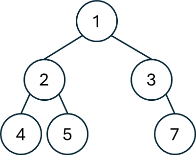

## 思路
<table>
<tr>
<td width="80%">

前序遍歷是按照`[中，左，右]`的順序去輸出的，\
也就是先輸出中間的節點，再輸出左樹的節點，最後右樹的節點。\
以右圖為例，輸出的順序就是 $[1,2,4,5,3,7]$ ，\
一開始中間節點是 $1$ ，左樹是 $[2,4,5]$ ，右樹是 $[3,7]$ 
</td>
<td valign="top">


</td>
</tr>
</table>

現在要用`stack`去實現中序遍歷，先輸出中間節點，接下來要先左再右，因此壓入棧時，要先右再左。
## 程式碼
### 1. 用棧實現前序遍歷
```cpp
class Solution {
public:
    vector<int> preorderTraversal(TreeNode* root) {
        if(!root) return {};
        vector<int> res;
        stack<TreeNode*> stk;
        stk.push(root);
        while(!stk.empty()) {
            TreeNode* cur = stk.top(); stk.pop();
            res.push_back(cur->val);
            if(cur->right) stk.push(cur->right);
            if(cur->left) stk.push(cur->left);
        }        
        return res;
    }
};
```
### 2. 遞迴
```cpp
class Solution {
private:
    void traverse(TreeNode* node, vector<int>& res) {
        if(!node) return;
        res.push_back(node->val);
        traverse(node->left, res);
        traverse(node->right, res);
    }
public:
    vector<int> preorderTraversal(TreeNode* root) {
        vector<int> res;
        traverse(root, res);
        return res;
    }
};
```
## 複雜度分析
- 時間複雜度：$O(n)$
- 空間複雜度：$O(n)$