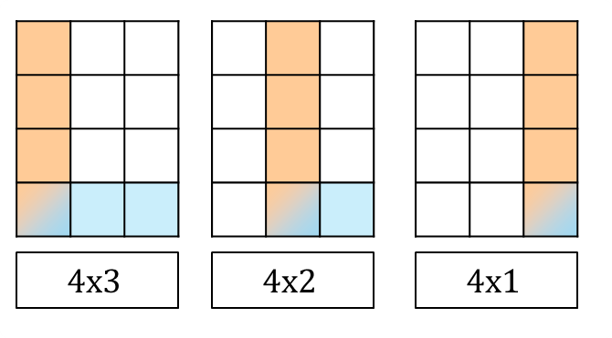

## 思路
給定一個二維陣列，要找出子矩陣全為 1 的數量有多少。\
對於這個問題，可以用類似 全是 1 的最大矩形 的方法去做，我們將問題拆成一系列一維問題。\
假如其中一個一維問題對應的一維矩陣是 $[4,9,7,2]$ ，這時我們要去找「包含最後一列矩陣」的子矩形一共有多少個，若是不包含，就會重複計算。
1. 對於 4 來說，就去找高度為 4 的長方形一共有幾個。
  - 右邊遇到第一個比自己小的數字是 2，不能包含那一直行的內容，一旦包含，高度就無法維持 4 了。
  - 左邊沒有數字，邊界位置在 $-1$ 。
  - 以 4 為高度的長方形，最寬寬度是 $3-(-1)-1=3$ 。
2. 對於 9 來說，去找高度為 9 的長方形一共有幾個。
  - 右邊遇到第一個比自己小的數字是 7。
  - 左邊遇到第一個比自己小的數字是 4。
  - 以 9 為高度的長方形，最寬寬度是 $2-0-1=1$ 

<table>
<tr>
<td valign="top" width="70%">

知道最大的長方形之後，在裡面任意選擇左上右下兩個點。形成的矩形都是滿足條件的子矩陣，需要注意的是，同樣要包含最後一列的元素在內。\
右圖以第一個例子示意，橘色框代表左上的選擇，藍色框代表右下的選擇。\
一共有 $4\times(1+2+3)=24$ 這麼多種選擇。
</td>
<td>


</td>
</tr>
</table>

也就是說，在高度為 $h$ ，寬度為 $w$ 時，\
一共會新增 $h\times(1+2+\dots+w)=h\times\frac{(1+w)w}{2}$ 這麼多種選擇。

這樣做還是會重複計算。
1. 處理 9 的時候（高度 h = 9, 寬度 w = 1）：
    - 算出以 9 為高度的子矩形有  $9\times\frac{1(2)}{2}=9$ 個。
    - 這 9 個矩形的高度分別是 `1,2,3,...,9`。
2. 處理 7 的時候（高度 h=7, 寬度 w=2，即下標 1∼2）：
    - 算出以 7 為高度的子矩形有  $7\times\frac{2(3)}{2}=21$ 個。
    - 問題來了， 這 21 個矩形中，包含了高度為 1∼7、寬度為 1（位於下標 1，也就是原本 9 的位置）的矩形。
    - 但是，在第一步處理 9 的時候，已經把下標 1 位置高度 1∼7 的矩形算過一次了。\
為了不重覆，我們必須給每個柱子分配「專屬的責任範圍」。\
單調棧的邏輯是：每個柱子只負責計算「高出它左右鄰居中較高者」的那部分高度。

回到  $[4, 9, 7, 2]$ ：
1. 當 9 被彈出時（左邊是 4，右邊是 7）：
    - 它能延伸的寬度 `w = 1`。
    - 它的鄰居中較高的是 7，所以`bottom = 7`。
    - 它只負責高度 8 和 9 這兩層。
    - 數量： $(9−7)\times\frac{1(2)}2=2$  個。
2. 當 7 被彈出時（左邊是 4，右邊是 2）：
    - 它能延伸的寬度 `w = 2`（包含原本 9 的位置）。
    - 它的鄰居中較高的是 4，所以 `bottom = 4`。
    - 它負責高度 5,6,7 這三層。
    - 數量： $(7−4)\times\frac{2(3)}2=3×3=9$  個。
3. 當 4 被彈出時（左邊是邊界，右邊是 2）：
    - 它能延伸的寬度 `w = 3`。
    - 它的鄰居中較高的是 2，所以 `bottom = 2`。
    - 它負責高度 3,4 這兩層。
    - 數量： $(4−2)\times\frac{3(4)}2=2×6=12$  個。
4. 最後處理 2：
    - `bottom = 0`。
    - 數量： $(2−0)\times\frac{4(5)}2=2×10=20$  個。
## 程式碼
### 單調棧
```cpp
class Solution {
private:
    static const int MX = 151;
    int height[MX];
    int stk[MX];
public:
    int numSubmat(vector<vector<int>>& mat) {
        int m = mat.size(), n = mat[0].size();
        fill(height, height + n, 0);

        auto calc = [&]() -> int {
            int res = 0;
            int j = -1; // 指向棧頂的指針
            for(int i = 0; i < n; i++) {
                while(j >= 0 && height[stk[j]] > height[i]) {
                    int left = j - 1 >= 0 ? stk[j - 1] : -1;
                    int w = i - left - 1; // 開區間邊界的寬度
                    int bottom = max((left == -1 ? 0 : height[left]), height[i]);
                    int h = height[stk[j]] - bottom; // 高度要減去左右比較大的那一個
                    res += h * ((1 + w) * w) / 2;
                    --j;
                }
                stk[++j] = i;
            }
            while(j >= 0) {
                int left = j - 1 >= 0 ? stk[j - 1] : -1;
                int w = n - left - 1;
                int bottom = left == -1 ? 0 : height[left];
                int h = height[stk[j]] - bottom;
                res += h * ((1 + w) * w) / 2;
                --j;
            }
            return res;
        };

        int res = 0;
        for(int i = 0; i < m; i++) {
            for(int j = 0; j < n; j++) {
                height[j] = mat[i][j] == 1 ? height[j] + 1 : 0;
                // cout << height[j] << " ";
            }
            int add = calc();
            // cout << " " << add << "\n";
            res += add;
        }
        return res;
    }
};
```
## 複雜度分析
- 時間複雜度：$O(n)$
- 空間複雜度：$O(n)$

