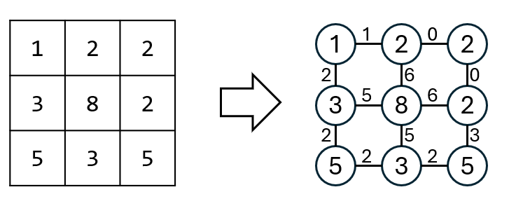

## 思路

<table>
<tr>
<td valign="top" width="54%">

從起點走到終點，一路上踩到的格子如果是 $[1,2,3,8,3]$ ，相鄰兩格的絕對差是 $[1,1,5,5]$，這條路徑的體力消耗就是 `max(1,1,5,5)`。\
兩個節點間的絕對差，能視為兩個節點間的距離。\
因此能知接套用最短路徑演算法。\
每一個節點的鄰居都是固定的，因此實際上不需要一張圖記錄鄰居，而是能直接開始 Dijkstra。

</td>
<td>



</td>
</tr>
</table>

## 程式碼

### 1. 鏈式前向星建圖 + Dijkstra

```cpp
class Solution {
private:
    static const int MX_N = 1e5 + 1; // 100 * 100 + 1
    static const int MX_M = 39600 + 1; // 99 * 100 * 2 * 2 + 1

    // 鏈式前向星
    int head[MX_N];
    int to[MX_M];
    int next[MX_N];
    int weight[MX_N];
    int cnt;

    // Dijkstra
    int dist[MX_N];
    bool visited[MX_N];

    void build(int size) {
        // 鏈式前向星初始化
        cnt = 1;
        fill(head, head + size + 1, 0);

        // Dijkstra 初始化
        fill(dist, dist + size + 1, INT_MAX);
        fill(visited, visited + size + 1, false);
    }

    void addEdge(int u, int v, int w) {
        next[cnt] = head[u];
        head[u] = cnt;
        to[cnt] = v;
        weight[cnt] = w;
        cnt++;
    }

public:
    int minimumEffortPath(vector<vector<int>>& heights) {
        const int dir[5] = {-1, 0, 1, 0, -1};
        int m = heights.size();
        int n = heights[0].size();

        build(m * n);

        for(int i = 0; i < m; i++) {
            for(int j = 0; j < n; j++) {
                for(int k = 0; k < 4; k++) {
                    int ni = i + dir[k];
                    int nj = j + dir[k + 1];
                    if(ni < 0 || ni >= m || nj < 0 || nj >= n) continue;
                    addEdge(i * n + j, ni * n + nj, abs(heights[ni][nj] - heights[i][j]));
                }
            }
        }

        using pii = pair<int, int>;
        priority_queue<pii, vector<pii>, greater<pii>> pq; // dist, node
        pq.emplace(0, 0);
        dist[0] = 0;

        while(!pq.empty()) {
            auto [curDist, node] = pq.top(); pq.pop();
            if(curDist > dist[node]) continue;
            // if(visited[node]) continue;
            // visited[node] = true;
            if(node == (m - 1) * n + n - 1) {
                return curDist;
            }
            for(int ei = head[node]; ei != 0; ei = next[ei]) {
                int newDist = max(curDist, weight[ei]);
                if(newDist < dist[to[ei]]) {
                    dist[to[ei]] = newDist;
                    pq.emplace(dist[to[ei]], to[ei]);
                }
            }
        }
        return -1; // impossible;
    }
};
```

## 複雜度分析

- 時間複雜度：$O(mn\log(mn))$
- 空間複雜度：$O(mn)$
