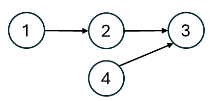
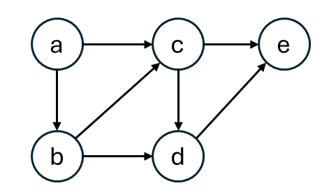

建議事前閱讀：[圖的表示方式](https://gjplieqszy7.sg.larksuite.com/wiki/KJC1wRJAqidzAqkpCEClyp2YgUf#share-SKrIdfSCUoljvvxsiypl77TmgCh)
## 思路
<table>
<tr>
<td  width="60%">

給定一張有向圖，要求輸入滿足以下條件：
- 指向自己的節點要比自己靠前。

也就是說，在所有指向自己的節點都被輸出後，自己才能被輸出。
</td>
<td>


</td>
</tr>
</table>

拿上圖為例，合法的拓樸排序有 $[1,2,3,4],[1,2,4,3],[1,4,2,3],[4,1,2,3]$ 這幾種，\
原因是 4 沒有任何限制，而 1, 2, 3 必須按照先後順序輸出。\
拓樸排序只有在圖為有向無環時才有用，否則會有循環依賴的問題，也因此能用來求是否有環存在。
> 就像遊戲裡面的技能樹，某些技能依賴你先解鎖其他三種技能才能解開之類的。

---

<table>
<tr>
<td  width="70%">

「入度出度法」被用來解決拓樸排序。
- 入度：紀錄有多少邊指向自己，

在最開始時，入度為 0 的點沒有限制，因此將它排在前面，\
並將它所造成的影響抹除，
</td>
<td>


</td>
</tr>
</table>

以上圖來說就是 $a$ ，在將 $a$ 放到最開始的位置之後， $b, c$  的入度因此減少了。\
對於 $b$ 來說，在 $a$ 的影響被抹掉之後，自己的入度為 0，因此可以輸出。\
輸出 $a, b$ 後， $c$ 的入度變成 0，也可以輸出。\
就這樣持續下去，直到沒有點可以輸出，假如最後有點沒被輸出，表示有環。
> 最初可以解鎖沒有要求的技能，隨後看看自己因為解鎖這項技能，能夠點開哪些其他技能。

## 程式碼
### 拓樸排序
```cpp
class Solution {
public:
    vector<int> findOrder(int numCourses, vector<vector<int>>& prerequisites) {
        vector<int> indegree(numCourses); // 紀錄每個課程的入度
        vector<vector<int>> graph(numCourses); // 鄰接表
        for(auto& v : prerequisites) {
            indegree[v[0]]++;
            graph[v[1]].push_back(v[0]);
        }
        queue<int> q; // 最初，將入度為 0 的課程放到隊列中
        for(int i = 0; i < numCourses; i++) {
            if(indegree[i] == 0) {
                q.push(i);
            }
        }
        vector<int> res;
        while(!q.empty()) { 
            int top = q.front(); q.pop();
            res.push_back(top); // 在隊列中的課程都是入度為 0 的課
            for(auto& neighbor : graph[top]) { // 查看鄰居，並減去入度
                if(--indegree[neighbor] == 0) { // 假如鄰居因此入度為 0, 放入隊列
                    q.push(neighbor);
                }
            }
        }
        if(res.size() == numCourses) { // 成功修完所有的課
            return res;
        }
        return {}; // 沒有修完
    }
};
```
## 複雜度分析
- 時間複雜度：$O(n + m)$，
- 空間複雜度：$O(n + m)$，

