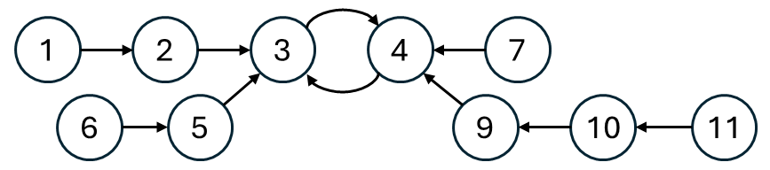
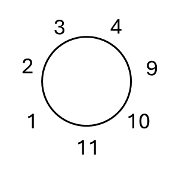
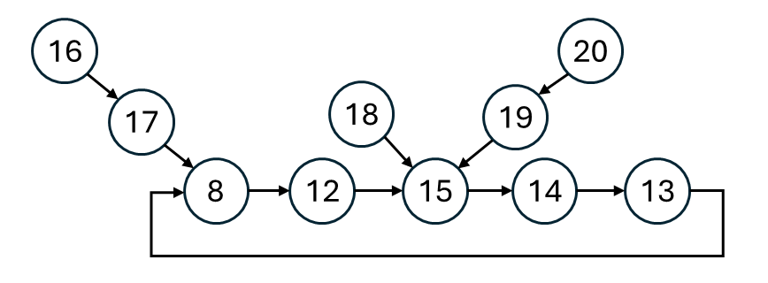

推薦事前閱讀：[拓樸排序介紹](https://gjplieqszy7.sg.larksuite.com/wiki/KJC1wRJAqidzAqkpCEClyp2YgUf#share-GhfudjY2soFdhxx1jlzljHXCgTe)
## 思路
每個員工旁邊要存在自己喜歡的員工，自己才會參加會議。\
因為每個員工只會喜歡一個員工，所以不需要建圖，每個員工只會有一個鄰居，相當於`favorite`就是圖。
假設 $0\to1\to2\to3$ ，這一條「喜歡」的鏈成立，那麼這些員工就都會參加會議。\
可以允許環的存在，像 $0\to1\to2\leftrightarrow3\leftarrow4$ 這樣的喜歡順序，也是成立的。\
整體來看，有分為大環跟小環兩種情況。
1. 小環：最中心有兩個人互相喜歡，在這兩人的鏈當中各選出最長的那一個，形成圓桌。
<table>
<tr>
<td valign="top" width="81.5%" align="center">


小環
</td>
<td align="center">


小環對應的圓桌
</td>
</tr>
</table>

- 需要注意的是，當有多個小環存在的時候，所有的小環以及兩點的最長鏈，都可以加入圓桌。
- 拿簡單的例子來說，$3\to1\leftrightarrow2\leftarrow4,6\leftrightarrow7\leftarrow5$ 可以合併。（自己畫圖推看看！）

2. 大環：喜歡的人形成一個大環，指向成員的鏈，不可以加入到圓桌當中。比如把圖中 20 的鏈加入，那麼圓桌的順序會變成 $20\to19\to15\to14\to13\to8\to12$ ，而 12 沒有坐在自己喜歡的對象旁邊，圓桌不成立。
      - 當有多個大環時，只能選擇其中一個作為答案參考，選大小最大的那一個
      <table align="center" width="80%"><tr><td align="center">

      
      </td></tr></table>

至於單純的鏈，是不能坐進圓桌的，否則鏈尾元素就沒有坐在自己喜歡對象的旁邊，因此不能列入參考。

---

在小環的情況中，我們要找到兩個點的最長鏈，算出總和之後，跟其他小環的大小一起合併。\
在大環的情況中，我們要找到環本身的長度，跟其他大環的大小取最大值。\
為了要紀錄最長鏈，我們開一個deep陣列，用來記錄每個節點最長鏈的大小，\
- 前往鄰居節點的最長鏈大小 = $\max(\small{當前答案，自己的最長鏈長度 + 1})$ 

使用拓樸排續計算最長鏈大小，最後留下的節點，假如入度不是 1，就代表自己是環當中的一員。
## 程式碼
### 拓樸排序
```cpp
class Solution {
public:
    int maximumInvitations(vector<int>& favorite) {
        int n = favorite.size();
        vector<int> indegree(n);
        // favorite[i] = j, 代表 i -> j 的邊
        for(int i = 0; i < n; i++) {
            indegree[favorite[i]]++;
        }
        vector<int> deep(n); // 用 deep 記錄來到當前節點時，不包含自己，最長鏈的長度
        queue<int> q;
        for(int i = 0; i < n; i++) {
            if(indegree[i] == 0) q.push(i);
        }
        while(!q.empty()) {
            int u = q.front(); q.pop();
            int v = favorite[u];
            deep[v] = max(deep[v], deep[u] + 1); // 比較最長鏈長度，選最長的
            if(--indegree[v] == 0) {
                q.push(v);
            }
        }
        // 此時入度不為 0 的點，都是環的內部節點
        int sumOfSmallRings = 0;
        int bigRings = 0;
        for(int i = 0; i < n; i++) {
            if(indegree[i] != 0) {
                int size = 1;
                indegree[i] = 0; // 把走訪過的點標記為入度 0, 避免鄰居重複計算
                int cur = favorite[i]; // 先前進一步
                while(cur != i) { // 不斷前進，直到回到初始位置 i 
                    indegree[cur] = 0;
                    cur = favorite[cur];
                    size++;
                }
                if(size == 2) { // 小環, 自己與鄰居的最長鏈 + 環的兩節點
                    sumOfSmallRings += deep[i] + deep[favorite[i]] + 2;
                }
                else { // 大環
                    bigRings = max(bigRings, size);
                }
            }
        }
        return max(sumOfSmallRings, bigRings);
    }
};
```
## 複雜度分析
- 時間複雜度：$O(n)$
- 空間複雜度：$O(n)$

