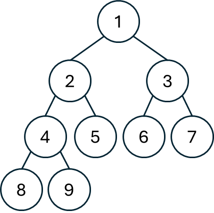

## 思路
因為是一個「完全二叉樹」，假如整棵樹的高度是 $\text{H}$ ，所有葉節點的位置都會在 $\text{H}$ 或 $\text{H-1}$ 。可以利用這個特性快速找出節點個數。

<table>
<tr>
<td width="80%">

因為<span style="color:var(--color-accent-fg)">缺口一定會在右邊</span>，要想知道完全二叉樹的高度，只需要從根結點出發，一路向左，整條路的高度即為所求。\
以右圖為例，一路往左就能找到高度為 4。如果沒有`[7,8,9]`三個節點，會找到最左的4，高度為3。\
找到高度之後，接下來看<span style="color:var(--color-accent-fg)">右樹的最左節點高度</span>在哪裡。

</td>
<td valign="top">


</td>
</tr>
</table>

1. 假如它的高度是 $\text{H}$ ，那就代表左樹一定是滿的，因為最底部的節點會先填滿左邊再去填右邊。
    - 這時左樹共有幾個節點？
        - 我們知道現在整棵樹的高度是 $\text{H}$ ，因此左樹的高度是 $\text{H-1}$ ，一共有 $2^{H-1}-1$ 個節點。
    - 接下來要算右樹的節點數量，而右樹同樣也是一個完全二叉樹，跟最初的問題一樣，只是規模更小，所以能遞迴找到答案。\
    整體答案： $\text{dfs}(root) = 1 + (2^{H-1}-1) + \text{dfs}(root\to{right})$ （根結點 + 左樹節點數量 + 右樹節點數量）
2. 若它的高度是 $\text{H-1}$ ，代表右樹所有的葉節點都在高度 $\text{H-1}$ ，跟第一種情況類似，依樣畫葫蘆就好。
    - 這時右樹一共有 $2^{H-2}-1$ 個節點。
    - 左樹也是一個完全二叉樹，能遞迴呼叫得到答案。\
    整體答案： $\text{dfs}(root) = 1 + \text{dfs}(root\to{left}) + (2^{H-2} - 1)$ （根結點 + 左樹節點數量 + 右樹節點數量）

## 程式碼
### 1
```cpp
class Solution {
public:
    int countNodes(TreeNode* root) {
        if(!root) return 0;
        auto mostLeft = [](TreeNode* cur, int level){
            while(cur) {
                cur = cur->left;
                ++level;
            }
            return level - 1; // 遇到空節點時停下, 要 - 1。
        };
        int mxHeight = mostLeft(root, 1);
        auto dfs = [&](this auto&&dfs, TreeNode* node, int level) -> int { 
            // 當前在葉節點。高度為 mxHeight - 1 必定不會到這裡。
            if(level == mxHeight) return 1; 
            if(mostLeft(node->right, level + 1) == mxHeight) {
                return (1 << (mxHeight - level)) + dfs(node->right, level + 1);
            }
            else {
                return (1 << (mxHeight - level - 1)) + dfs(node->left, level + 1);
            }
        };
        return dfs(root, 1);
    }
};
```
## 複雜度分析
- 時間複雜度：$O(\log^2{n})$
- 空間複雜度：棧空間 $O(\log{n})$

