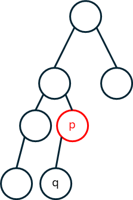
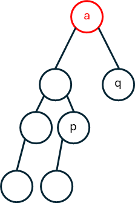

## 思路

<table>
<tr>
<td width="70%">

題目的要找到兩個節點的「最近共同祖先」，以右圖為例，
1. `[2,5]`的共同祖先是 2。
2. `[4,5]`的共同祖先是 2，
3. `[2,7]`的共同祖先是 1。
以下假設要找 $p,q$ 的共同祖先，則可以分為兩種情況

</td>
<td valign="top">


</td>
</tr>
</table>
<table>
<tr>
<td width="70%">

第一種情況：其中一個節點是另一個節點的祖節點，此時回傳祖節點。\
第二種情況：兩個節點沒有祖孫之分，而是有一個共同祖先。\
遞迴搜索時，假如遇到 $p$ 或是 $q$ ，就將找到的 $p$ 或 $q$ 往上傳。\
為了滿足第一種情況，在搜索時如果自身就是 $p$ 或 $q$ ，優先傳回自己。\
在左右都有傳回答案時，此時自己是滿足條件的祖先，也傳回自己。

</td>
<td width="15%" valign="top" align="center">


情況一

</td>
<td valign="top" align="center">


情況二
</td>
</tr>
</table>

## 程式碼
```cpp
class Solution {
public:
    TreeNode* lowestCommonAncestor(TreeNode* node, TreeNode* p, TreeNode* q) {        
        if(!node || node == p || node == q) return node;
        TreeNode* left = lowestCommonAncestor(node->left, p, q);
        TreeNode* right = lowestCommonAncestor(node->right, p, q);
        if(!left && !right) return nullptr; // 都沒有找到, 把空往上傳
        if(left && right) return node; // 左邊有找到, 右邊也有找到, 自己就是祖先
        // 現在只有一個是空的, 返回不是空的那一邊
        return !left ? right : left;
    }
};
```
## 複雜度分析
- 時間複雜度：$O(n)$
- 空間複雜度：棧空間 $O(\log{n})$

