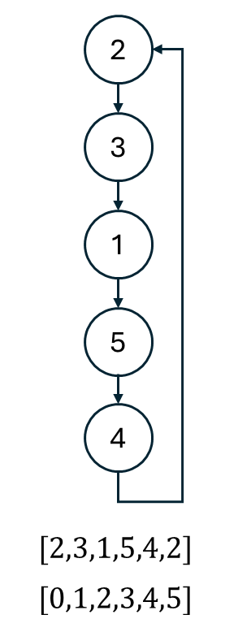

## 思路
<table>
<tr>
<td valign="top" width="85%">

給定數組 $\begin{aligned}
nums = & [2,3,1,5,4,2]\\
index = & [0,1,2,3,4,5]
\end{aligned}$ ，重複的數字為 $2$，
因為`index`跟`nums`的範圍大致相同，可以利用快慢指針去找到目標數字。
`nums[i]`就是下次要跳轉的目標位置。
比如現在從`index = 0`出發，看到數字 2，就來到 `nums[2]`，
再看到數字 $1$ ，來到`nums[1]`，如此往下前進。
由於有重複數字的存在，最後會進入一個迴圈，重複的數字，就是環的起點。
找環起點的算法在 [[142]] 有提到。
</td>
<td>


</td>
</tr>
</table>

## 程式碼
### 快慢指針
```cpp
class Solution {
public:
    int findDuplicate(vector<int>& nums) {
        int slow = nums[0], fast = nums[nums[0]];
        while(slow != fast) {
            slow = nums[slow];
            fast = nums[nums[fast]];
        }
        slow = 0;
        while(slow != fast) {
            slow = nums[slow];
            fast = nums[fast];
        }
        return slow;
    }
};
```
## 複雜度分析
- 時間複雜度：$O(n)$
- 空間複雜度：$O(1)$

