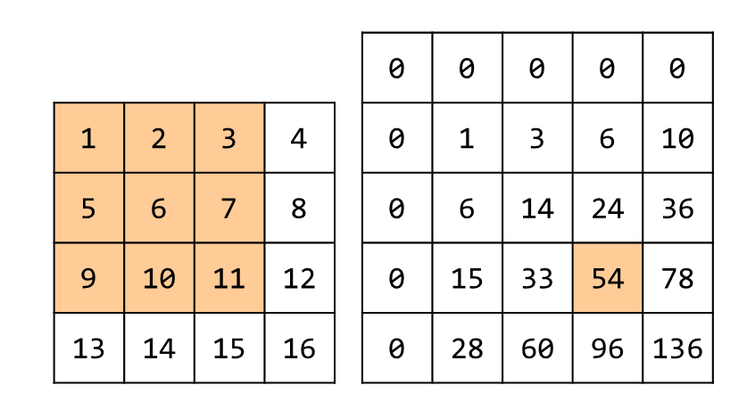
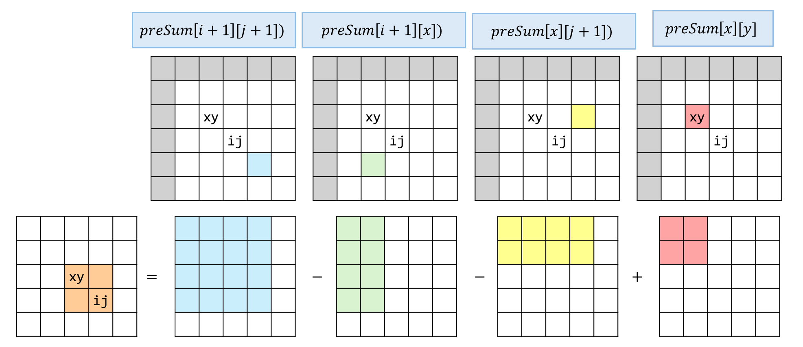

## 思路
二維前綴和的基本題目


<table><tr>
<td>

將前綴和進化成二維，如右圖所示，會加入 0 的關係也是為了計算方便而做的。
格子 $prefixSum[i][j]$ 紀錄的數值，代表以 $(0,0)$ 為左上， $(i-1,j-1)$ 為右下角的矩形區域總和。\
這樣就能在預處理之後，用 $O(1)$ 的速度來查找任意二維陣列的區域面積，公式如圖所示
</td>
<td align="right" width="30%">


</td>
</tr></table>



- 每個維度 + 1
- 矩陣的 $(0, 0)$ 對應到前綴數組中的 $(1,1)$
## 程式碼
### 二維前綴和
```cpp
class NumMatrix {
private:
    vector<vector<int>> vec;
public:
    NumMatrix(vector<vector<int>>& matrix) {
        int m = matrix.size(), n = matrix[0].size();
        vec = vector<vector<int>>(m + 1, vector<int>(n + 1, 0)); // 每個維度多加一
        for(int i = 1; i <= m; ++i) { // 矩陣的 0, 0, 對應到前綴數組的 1, 1
            for(int j = 1; j <= n; ++j) {
                vec[i][j] = vec[i - 1][j] + vec[i][j - 1] - vec[i - 1][j - 1] + matrix[i - 1][j - 1];
            }
        }
    }
    
    int sumRegion(int row1, int col1, int row2, int col2) {
        return vec[row2 + 1][col2 + 1] - vec[row2 + 1][col1] - vec[row1][col2 + 1] + vec[row1][col1];
    }
};
```
## 複雜度分析
- 時間複雜度：$O(mn)$
- 空間複雜度：$O(mn)$