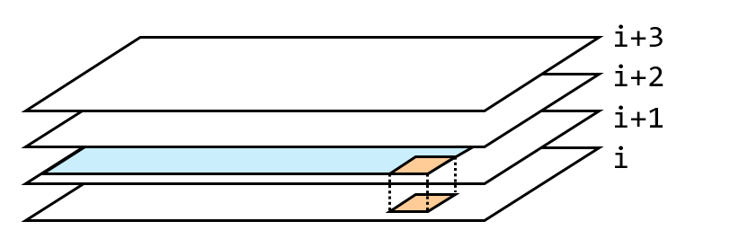

## 思路

從暴力遞迴開始，定義`dfs(i,z,o)`代表從strs[i...]中任選字串，其中 1 的出現次數 $\leq o$ ，0 的出現次數 $\leq z$ ，問最多能選幾個字串。
對於當前位置的strs[i]，共有 $zero$ 個 0, $ones$ 個 1 在字串中，我們有兩種方案，選或不選。

- 選`strs[i]`，對應`dfs(i+1,z-zero,o-ones)`，一旦選擇，代表當前的「預算」z, o 需要扣掉「買這個字串的成本」，並往下一層前進。
- 不選`strs[i]`，對應`dfs(i+1,z,0)`，相當於跳過這個字串，往後面瀏覽其他字串。

### 1. 暴力遞迴

```cpp
class Solution {
private:
public:
    int findMaxForm(vector<string>& strs, int m, int n) {
        int len = strs.size();

        // dfs(i, z, o) 代表從 strs[i...len-1]中，自由選擇字串
        // 在 0 出現次數 <= z, 1 出現次數 <= o 的情況下，最多能選幾個字串
        auto dfs = [&](this auto&&dfs, int i, int z, int o) -> int {
            if(i == len) { // 邊界條件
                return 0;
            }

            int a = dfs(i + 1, z, o); // 不選擇 strs[i]

            int b = 0; // 選擇 strs[i]
            int ones = count(strs[i].begin(), strs[i].end(), '1');
            int zero = strs[i].length() - ones;
            if(zero <= z && ones <= o) {
                b = 1 + dfs(i + 1, z - zero, o - ones);
            }
            int res = max(a, b);
            return res;
        };

        return dfs(0, m, n);
    }
};
```

同樣的，這時可能有很多被重複呼叫的部分，能轉成記憶化搜索。

### 2. 記憶化搜索

```cpp
class Solution {
public:
    int findMaxForm(vector<string>& strs, int m, int n) {
        vector<int> cnt0(strs.size());
        for(int i = 0; i < strs.size(); ++i) {
            cnt0[i] = ranges::count(strs[i], '0');
        }
        // memo[k][m][n] = 前 k 個字串, strs的最大子集長度, 最多有 m 個 0 跟 n 個 1
        vector memo(strs.size(), vector<vector<int>>(m + 1, vector<int>(n + 1, -1)));
        auto dfs = [&](this auto&& dfs, int i, int j, int k) {
            if(i < 0) {
                return 0;
            }
            int& res = memo[i][j][k];
            if(res != -1) {
                return res;
            }
            res = dfs(i - 1, j, k); // 不選
            int cnt1 = strs[i].size() - cnt0[i];
            if(j >= cnt0[i] && k >= cnt1) { // 選
                res = max(res, 1 + dfs(i - 1, j - cnt0[i], k - cnt1));
            }
            return res;
        };
        return dfs(strs.size() - 1, m, n);
    }
};
```

每次更新當前格子`dp[i][j][k]`時，需要先算好的數值必定是`dp[i+1][<=j][<=k]`的數值，更新表時要確保先算好這些依賴數值。



<p style="text-align:center;">每一個 dp格子更新，會參考橘色的數值，可能參考藍色區塊的某格數值</p>

### 3. 遞推

```cpp
class Solution {
private:
    static const int MXLEN = 601;
    static const int MXN = 101;
    int dp[MXLEN][MXN][MXN];
public:
    int findMaxForm(vector<string>& strs, int m, int n) {
        int len = strs.size();

        // dp[i][z][o] 代表從 strs[i...len-1]中，自由選擇字串
        // 在 0 出現次數 <= z, 1 出現次數 <= o 的情況下，最多能選幾個字串
        for(int i = len - 1; i >= 0; i--) {
            int ones = count(strs[i].begin(), strs[i].end(), '1');
            int zero = strs[i].length() - ones;
            for(int j = 0; j <= m; j++) {
                for(int k = 0; k <= n; k++) {
                    if(zero <= j && ones <= k) {
                        dp[i][j][k] = max(dp[i + 1][j][k], 1 + dp[i + 1][j - zero][k - ones]);
                    }
                    else {
                        dp[i][j][k] = dp[i + 1][j][k];
                    }
                }
            }
        }
        return dp[0][m][n];
    }
};
```

利用遞推的結果，進一步做空間壓縮，壓縮到二維矩陣，每次更新需要自己下一層的數值，更新時注意要從右下往左上更新，避免用到這一層更新的數值。

```cpp
class Solution {
private:
    static const int MXN = 101;
    int dp[MXN][MXN];
public:
    int findMaxForm(vector<string>& strs, int m, int n) {
        int len = strs.size();
        for(int i = len - 1; i >= 0; i--) {
            int ones = count(strs[i].begin(), strs[i].end(), '1');
            int zero = strs[i].length() - ones;
            for(int j = m; j >= zero; j--) { // 注意更新順序與範圍
                for(int k = n; k >= ones; k--) {
                    dp[j][k] = max(dp[j][k], 1 + dp[j - zero][k - ones]);
                }
            }
        }
        return dp[m][n];
    }
};
```

## 複雜度分析

> $L$ 是 `strs` 中所有字串的長度和

- 時間複雜度：$O(mnk + L)$，
- 空間複雜度：空間壓縮前 $O(mnk)$，空間壓縮後 $O(mn)$
