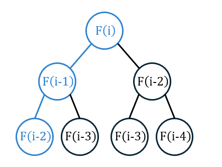

## 思路

$$
F(x)=\begin{cases}
0 & x=0\\
1 & x=1\\
F(x-1)+F(x-2) & \text{otherwise}
\end{cases}
$$

數列 $[0,1,1,2,3,5,8,13,21,34,\cdots]$ ，從第二項開始，每一項是前面兩項的合。
假如直接照著公式寫，能得到以下的程式碼。

```cpp title="費波納契數列 遞迴"
class Solution {
public:
    int fib(int n) {
        if(n == 0) return 0;
        if(n == 1) return 1;
        return fib(n - 1) + fib(n - 2);
    }
};
```

當你想得到 $F(7)$ 的數值時，需要先得知 $F(6)$ 與 $F(5)$ 的數值，能想像成一顆樹的左右兩個節點，而這兩個節點，也需要先得知各自左右節點 $F(5)+F(4), F(4)+F(3)$ 的數值是多少，最壞的情況，就是一共有 $2^n$ 的點要計算，因此複雜度 $O(2^n)$ 。

<table>
<tr>
<td valign="top" width="74%">

在展開計算的過程中，跟階乘的例子相同，有很多重複的數字。因此先將這些被用到的數字記錄下來，如果後續還需要用這些數值，就直接拿過來使用即可。
假設你現在要找數列的第 $n$ 項，最糟糕的情況是，它需要知道 $F(0)\sim F(n-1)$ 的所有數值。但由於數值一旦被計算，便會被記錄下來重複使用，因此複雜度降低為 $O(n)$

</td>
<td>



</td>
</tr>
</table>

右圖中，除了藍色節點外的所有節點在遞迴計算時，都能直接使用存下的數值加速計算。

```cpp title="費波納契數列 記憶化搜索"
class Solution {
private:
    static const int MX = 31;
    int dp[MX];
    int calc(int x) {
        if(dp[x] != -1) return dp[x]; // 已經被計算過，直接回傳答案
        dp[x] = calc(x - 1) + calc(x - 2); // 正常遞迴計算並填入表中
        return dp[x]; // 將計算好的數值回傳
    }
public:
    int fib(int n) {
        fill(dp, dp + n + 1, -1); // -1 代表還沒有被計算過。
        dp[0] = 0, dp[1] = 1;
        calc(n);
        return dp[n];
    }
};
```

上面的方法叫做從頂到底的動態規劃，從終點慢慢往起點找，並將中途遇到的子問題答案給記下來，方面後面重複利用。
反過來說，也有從底到頂的動態規劃，從起點出發往終點找，以此題為例，我們完全可以從前兩項往後推到第 $n$ 項的數值，而不需要從終點往前推。這種作法叫做遞推。

```cpp title="費波納契數列 遞推"
class Solution {
public:
    int fib(int n) {
        const int MX = 31;
        int dp[MX];
        dp[0] = 0, dp[1] = 1;
        for(int i = 2; i <= n; i++) {
            dp[i] = dp[i - 1] + dp[i - 2];
        }
        return dp[n];
    }
};
```

此時，每次計算 $dp[i]$ 的數值時，只會需要 $dp[i-1],dp[i-2]$ 兩個數值就行，因此實際上只需要三個變數，分別記錄這三個數值，將空間變為 $O(1)$ 。

```cpp title="費波納契數列 O(1) 空間"
class Solution {
public:
    int fib(int n) {
        if(n == 0) return 0;
        if(n == 1) return 1;
        int last1 = 0; // fib(0)
        int last2 = 1; // fib(1)
        int cur;
        for(int i = 2; i <= n; i++) {
            cur = last1 + last2;
            last1 = last2;
            last2 = cur;
        }
        return cur;
    }
};
```

## 複雜度分析

- 時間複雜度：$O(n)$
- 空間複雜度：空間壓縮前 $O(n)$, 壓縮後 $O(1)$
