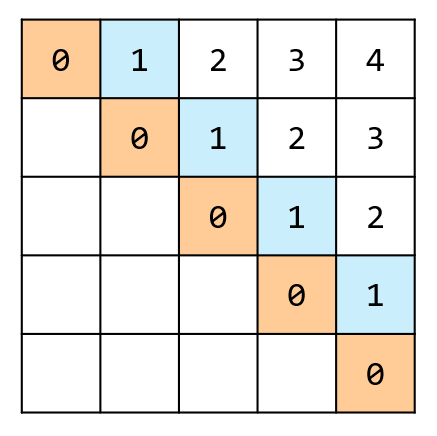
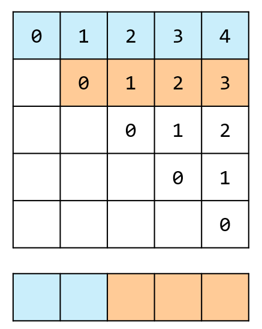

## 思路

比如當前字串`xxabsyyba`，答案就是`absba`。\
這個問題可以被轉化為最長公共子序列（LCS）問題，就是把字串`s`倒過來，記作`rev`。問題就相當於找 $\text{LCS}(s,rev)$ ，這部分就交給讀者自己去嘗試，本文用另一種方法。

### 暴力遞迴

依舊從暴力遞迴開始，定義`dfs(left, right)`代表`s[left...right]`的最長回文子序列。\
現在我們有左右兩個邊界，對應字元`s[l]`與`s[r]`。\
在一般情況下，如果`s[l]==s[r]`，代表這兩個字元能配對，作為迴文的兩端，然後與`dfs(l+1,r-1)`的迴文組合。

- 比如`axcya`，左右兩端的`a`配對，再去呼叫`dfs(1,3)`，找到子字串`xcy`的最長迴文長度。
  如果`l`跟`r`的距離相等，或是差一，對應實際字串就是長度在 1, 2 的情況下，這時要判斷它作為中心點的長度應該是多少

1. `l==r`，只有一個字元，長度為一。
2. `l + 1 == r`，有兩個字元，分情況討論
   - `s[l] == s[r]`，兩字元相同，可以做偶數字元中心。
   - `s[l] != s[r]`，兩字元不同，隨便選一個做奇數字元中心

```cpp title="暴力遞迴"
class Solution {
public:
    int longestPalindromeSubseq(string s) {
        int n = s.length();
        auto dfs = [&](this auto&&dfs, int l, int r) -> int {
            if(l == r) { // 單一個字元肯定是回文
                return 1;
            }
            if(l + 1 == r) { // 兩個字元，看能不能作為偶數中心
                return s[l] == s[r] ? 2 : 1;
            }

            if(s[l] == s[r]) { // 左右相同，彼此對應，長度 = dfs(l + 1, r - 1) + 2
                return 2 + dfs(l + 1, r - 1);
            }
            else {
                return max(dfs(l + 1, r), dfs(l, r - 1));
            }
        };
        return dfs(0, n - 1); // 左閉右閉
    }
};

```

加入記憶化搜索，避免重複計算。

```cpp title="記憶化搜索"
class Solution {
private:
    static const int MX = 1001;
    int dp[MX][MX];
public:
    int longestPalindromeSubseq(string s) {
        int n = s.length();

        for(int i = 0; i < n; i++) {
            fill(dp[i], dp[i] + n, -1);
        }

        auto dfs = [&](this auto&&dfs, int l, int r) -> int {
            if(l == r) { // 單一個字元肯定是回文
                return 1;
            }
            if(l + 1 == r) { // 兩個字元，看能不能作為偶數中心
                return s[l] == s[r] ? 2 : 1;
            }

            int& res = dp[l][r]; // 注意這裡是引用
            if(res != -1) {
                return res;
            }

            if(s[l] == s[r]) { // 左右相同，彼此對應，長度 = dfs(l + 1, r - 1) + 2
                res = 2 + dfs(l + 1, r - 1);
            }
            else {
                res = max(dfs(l + 1, r), dfs(l, r - 1));
            }
            return res;
        };

        return dfs(0, n - 1); // 左閉右閉
    }
};


```

<table>
<tr>
<td valign="top" width="80%">

### 遞推

想知道`dfs(l,r)`，先要知道左、下、左下的格子。\
換句話說，`r-l`越短就越應該先計算好。

1. 先計算`dp[0][0]`、`dp[1][1]`、`dp[2][2]`...
2. 再計算`dp[0][1]`、`dp[1][2]`、`dp[2][3]`...\
   因為 $r\geq l$ ，所以對應的`dp`表只會填主對角線以上的格子。\
   最終答案在最右上角的格子。

</td>
<td>



</td>
</tr>
</table>

```cpp title="遞推 按斜對角更新"
class Solution {
private:
    static const int MX = 1001;
    int dp[MX][MX];
public:
    int longestPalindromeSubseq(string s) {
        int n = s.length();

        for(int i = 0; i < n; i++) {
            dp[i][i] = 1; // 單一個字元肯定是回文
        }

        for(int i = 0; i + 1 < n; i++) {
            dp[i][i + 1] = s[i] == s[i + 1] ? 2 : 1; // 兩個字元，看能不能作為偶數中心
        }

        for(int diff = 2; diff < n; diff++) {
            for(int l = 0; l + diff < n; l++) {
                int r = l + diff;
                if(s[l] == s[r]) { // 左右相同，彼此對應，長度 = dfs(l + 1, r - 1) + 2
                    dp[l][r] = dp[l + 1][r - 1] + 2;
                }
                else {
                    dp[l][r] = max(dp[l + 1][r], dp[l][r - 1]);
                }
            }
        }
        return dp[0][n - 1];
    }
};

```

```cpp title="遞推 按列更新"
class Solution {
private:
    static const int MX = 1001;
    int dp[MX][MX];
public:
    int longestPalindromeSubseq(string s) {
        int n = s.length();

        for(int l = n - 1; l >= 0; l--) {
            dp[l][l] = 1; // 單一個字元肯定是迴文
            if(l + 1 < n) {
                // 兩個字元，看能不能作為偶數中心
                dp[l][l + 1] = s[l] == s[l + 1] ? 2 : 1;
            }
            for(int r = l + 2; r < n; r++) {
                if(s[l] == s[r]) {
                    // 左右相同，彼此對應，長度 = dfs(l + 1, r - 1) + 2
                    dp[l][r] = dp[l + 1][r - 1] + 2;
                }
                else {
                    dp[l][r] = max(dp[l + 1][r], dp[l][r - 1]);
                }
            }
        }
        return dp[0][n - 1];
    }
};


```

<table>
<tr>
<td valign="top" width="80%">

最後，可以嘗試把二維試著壓縮成一維。用按列更新的方式去修改會比較簡單。\
跟上題類似。每次更新當前位置數值時，用的是自己的左邊，下面，以及左下的數值。\
將使用空間減少到一列後，因為「左下」的數值會被覆蓋掉，還需要額外紀錄它的數值。\
右圖中，橘色是舊數值、藍色是新數值，此時正更新`dp[2]`。

</td>
<td>



</td>
</tr>
</table>

```cpp title="遞推 空間壓縮"
class Solution {
private:
    static const int MX = 1001;
    int dp[MX];
public:
    int longestPalindromeSubseq(string s) {
        int n = s.length();

        for(int l = n - 1; l >= 0; l--) {
            int leftdown;
            dp[l] = 1;
            if(l + 1 < n) {
                leftdown = dp[l + 1];
                dp[l + 1] = s[l] == s[l + 1] ? 2 : 1;
            }
            for(int r = l + 2; r < n; r++) {
                int backup = dp[r];
                if(s[l] == s[r]) {
                    dp[r] = leftdown + 2;
                }
                else {
                    dp[r] = max(dp[r], dp[r - 1]);
                }
                leftdown = backup;
            }
        }
        return dp[n - 1];
    }
};
```

## 複雜度分析

- 時間複雜度：$O(mn)$
- 空間複雜度：空間壓縮前 $O(mn)$, 壓縮後 $O(m)$
