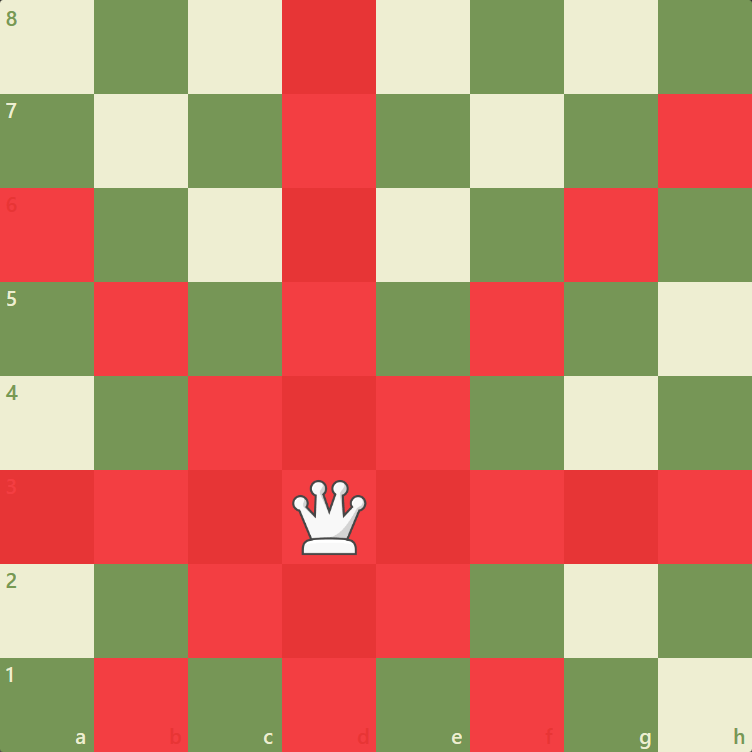
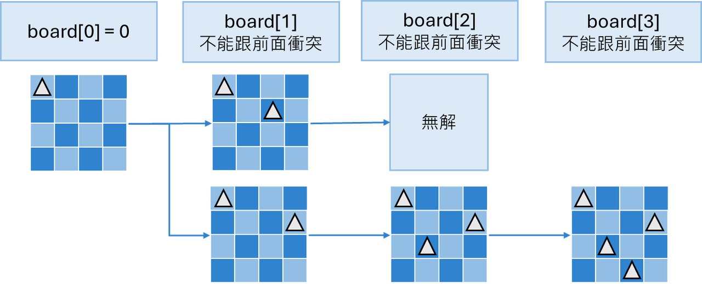
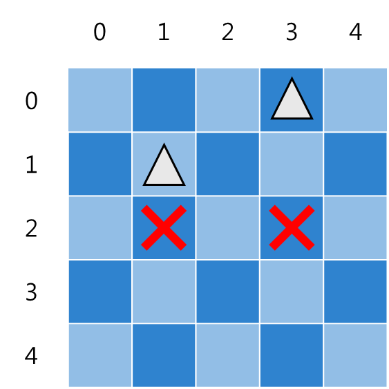
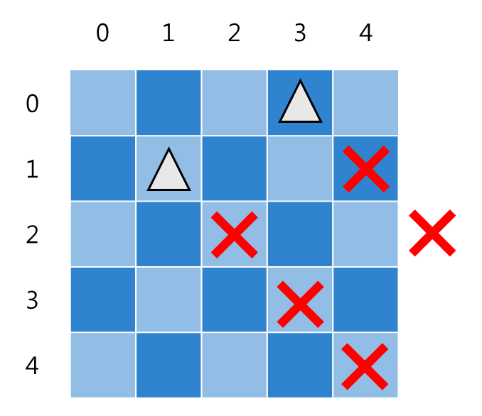
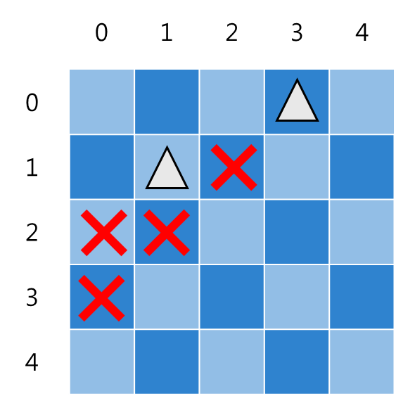

## 介紹
<table><tr>
<td valign="top">

在西洋棋當中的棋盤中，「皇后」能攻擊的方向，是自己所在位置的十字（上下左右），以及斜對角的所有方向。現在給定 $n\times{n}$ 的棋盤，問在這個棋盤當中，放下 $n$ 個棋子，並且不能互相攻擊到彼此，一共有幾種擺法。\
分為兩種做法，數組做法以及位運算做法，位運算的做法要快的多。
</td>
<td align="center" width="15%">


攻擊方向

</td>
</tr></table>

## 數組做法
定義`dfs(i)`代表從第i列擺放的方法數，每列從 $1\sim{n}$ 中選個位置擺放，並檢查跟之前的擺放有無衝突，如果走到底，代表找到了一種擺放方式。
- `board[i]`代表棋盤當中第i列當前擺放皇后的位置，也就避免了同一列擺兩個皇后的衝突情形。
- 判斷斜對角的方式是斜率，假如斜率為1或-1，兩個點就在棋盤的同一個位置。

---

下圖演示了，在 $4\times{4}$ 的棋盤中，從第 0 列開始嘗試的部分過程


### 程式碼：N皇后，數組方法（不推薦）
```cpp
class Solution {
public:
    int totalNQueens(int n) {
        vector<int> board(n); // 每一列放置的位置

        auto check = [&](int i, int j) -> bool {
            for(int k = 0; k < i; ++k) {
                if(j == board[k] || abs(i - k) == abs(board[k] - j)) { // 前面放到一樣的位置 or dx == dy (對角線有撞到), 就不能放
                    return false;
                }
            }
            return true;
        };

        auto dfs = [&](this auto&&dfs, int i) {
            if(i == n) { // 到達結尾, 代表找到一種正確方式
                return 1;
            }
            int res = 0;
            for(int j = 0; j < n; ++j) { // 每個位置都放放看
                if(check(i, j)) { // 可以放置
                    board[i] = j;
                    res += dfs(i + 1); // 下一列
                }
            }
            return res;
        };   
        
        return dfs(0);
    }
};
```

## 位運算方法
### 列限制
<table>
<tr>
<td valign="top">

假如棋盤的某個位置擺放了皇后，就將對應的位置標為 $1$，代表此位置使用過。\
首先只考慮列的限制：在擺放第一個皇后之後，\
用位運算表達當前列的狀態，就是 $01000$。\
在下一列選擇時，就只能將皇后擺放在除了 $0$ 的位置（單看列限制）。\
比如放在第三個位置，這時列限制是 $01010$。
</td>
<td valign="top" align="center" width="20%">


</td>
</tr>
</table>

### 主對角線限制
<table>
<tr>
<td valign="top">

在第一個皇后擺放之後，要怎麼表示「主對角線」在下一列的限制？
- 放了第一個皇后之後是 $01000$，下一列主對角線的限制是第四行不能放，也就是 $10000$。這兩者的關係是左移。
- 放第二個皇后之後，將它的位置跟當前限制做或運算，再次左移，得到下一列主對角線的限制 $00100$，左移時將一個 $1$ 消去了，而這也不影響判斷。\
需要注意的是，左移時超出去的$1$是無效的限制，此時限制實際上是 $100100$，但是只取最低五位，結果是 $00100$。
</td>
<td valign="top" align="center" width="20%">


</td>
</tr>
</table>

### 副對角線限制
<table>
<tr>
<td valign="top">

副對角線，跟主對角線同理。
- 放第一個皇后之後是 $01000$，下一列副對角線不能放第二個位置，$00100$，
兩者關係是右移。
- 放第二個皇后，將它的位置跟當前限制或運算，再次右移，
得到下一列限制 $00011$。\
最後將將所有的限制做或運算，就是當前擺放的整體限制。。
</td>
<td valign="top" align="center" width="20%">


</td>
</tr>
</table>

### 程式碼：N皇后，位運算作法
```cpp
class Solution {
private:
    int dfs(int& limit, int col, int right, int left) { // right 主對角線, left 副對角線
        if(col == limit) { // 所有位置都被選過了, 找到一個合法路徑
            return 1;
        }
        int ban = col | right | left;
        int candidate = limit & (~ban); // 可以選的位置有哪些
        int place = 0;
        int res = 0;
        while(candidate != 0) {
            place = candidate & (-candidate); // 取出最右的 1 
            candidate ^= place; // 把最右邊的 1 消除掉。
            res += dfs(limit, col | place, limit & ((right | place) << 1), (left | place) >> 1);
        }
        return res;
    }
public:
    int totalNQueens(int n) {
        int limit = (1 << n) - 1; // 限制範圍, 0...接 n 個 1
        return dfs(limit, 0, 0, 0);
    }
};
```
## 複雜度分析
- 時間複雜度：$O(n!)$
- 空間複雜度：$O(n)$

