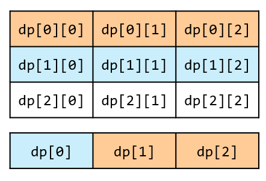

## Dijkstra

本題可以用 Djikstra 寫出解答，但複雜度比較高，因為它需要花費時間去排序 heap 當中的內容。實際上能避免排序的消耗，並以一種固定的順序，去更新各個節點的最短距離。\
因為能走的方向只有往右或往下，對於一個節點`(x,y)`來說，它所需要參考的最短距離，便只能從`(x-1,y)`，或是`(x,y-1)`來，想要知道`dist[x][y]`，就得先知道`dist[x - 1][y]`，`dist[x][y - 1]`。

> 如果能自由往四個方向，那麼想算出`dist[x][y]`得先知道`dist[x][y-1]`，而想知道`dist[x][y-1]`得先知道`dist[x][y]`，就矛盾了。

```cpp title="Djikstra"
class Solution {
private:
    const int dir[3] = {0, 1, 0}; // 兩個方向, 右跟下
public:
    int minPathSum(vector<vector<int>>& grid) {
        int m = grid.size();
        int n = grid[0].size();

        vector<vector<int>> dist(m, vector<int>(n, INT_MAX));
        dist[0][0] = grid[0][0];

        using tiii = tuple<int, int, int>;
        priority_queue<tiii, vector<tiii>, greater<tiii>> pq; // dist, x, y
        pq.emplace(grid[0][0], 0, 0);
        while(!pq.empty()) {
            auto [curDist, x, y] = pq.top(); pq.pop();
            if(x == m - 1 && y == n - 1) {
                return curDist;
            }
            for(int i = 0; i < 2; i++) {
                int nx = x + dir[i];
                int ny = y + dir[i + 1];
                if(nx < 0 || nx >= m || ny < 0 || ny >= n) continue;
                int newDist = curDist + grid[nx][ny];
                if(newDist < dist[nx][ny]) {
                    dist[nx][ny] = newDist;
                    pq.emplace(newDist, nx, ny);
                }
            }
        }
        return -1; // impossible
    }
};
```

## 記憶化搜索

根據題目，要想走到 $(x, y)$，可以從左邊或是上面來，也就是 $(x-1, y)$ 或 $(x, y-1)$。\
那麼，對於格子 $(x, y)$ 來說，最好的路徑就是下面兩種選項擇一。

- 走到 $(x-1, y)$ 的最小成本加上`grid[x][y]`
- 走到 $(x, y-1)$ 的最小成本加上`grid[x][y]`

那麼走到這兩個點的最小成本是多少呢？把上面那段文字的 $(x, y)$ 改成 $(x-1, y)$ 和 $(x, y-1)$ 就行。

遞迴時，我們能事先存下已經算過的值，就能避免重複計算。\
比如 $(x+1, y)$ 和 $(x, y+1)$，都會計算 $(x, y)$ 的最小成本，\
在第二次計算時，將事先紀錄的數字填入即可。

```cpp
class Solution {
public:
    int minPathSum(vector<vector<int>>& grid) {
        int m = grid.size(), n = grid[0].size();
        vector<vector<int>> memo(m, vector<int>(n, -1));
        auto dfs = [&](this auto&& dfs, int x, int y) -> int {
            if(x < 0 || y < 0) return INT_MAX; // 遞迴終點
            if(x == 0 && y == 0) return grid[x][y];
            int& res = memo[x][y]; // 這裡是引用
            if(res != -1) { // 代表有算過
                return res;
            }
            res = min(dfs(x - 1, y), dfs(x, y - 1)) + grid[x][y];
            return res;
        };
        return dfs(m - 1, n - 1);
    }
};
```

### 複雜度分析

- 時間複雜度：$O(mn)$，每個位置都被算一次。
- 空間複雜度：$O(mn)$，需要存下每個位置。

## 動態規劃

第二個方法是動態規劃，其實就是把上面的遞迴改成迭代。\
用`dp[i][j]`代表走到 $(i, j)$ 的最小成本。\
在更新`dp[i][j]`時，一樣可以從兩個方向來

- `dp[i-1][j]` + `grid[i][j]`
- `dp[i][j-1]` + `grid[i][j]`

因此可以得到轉移方程

$$
    dp[i][j] = \min(dp[i-1][j], dp[i][j-1]) + grid[i][j]
$$

```cpp
class Solution {
public:
    int minPathSum(vector<vector<int>>& grid) {
        int m = grid.size(), n = grid[0].size();
        vector<vector<int>> dp(m, vector<int>(n, INT_MAX));
        dp[0][0] = 0; // 初始值為 0，而不是 grid[0][0]
        for(int i = 0; i < m; ++i) {
            for(int j = 0; j < n; ++j) {
                if(i - 1 >= 0) dp[i][j] = dp[i - 1][j];
                if(j - 1 >= 0) dp[i][j] = min(dp[i][j], dp[i][j - 1]);
                dp[i][j] += grid[i][j];
            }
        }
        return dp[m - 1][n - 1];
    }
};
```

### 複雜度分析

- 時間複雜度：$O(mn)$，每個位置都被算一次。
- 空間複雜度：$O(mn)$，需要存下每個位置。

---

### 狀態壓縮

<table>
<tr>
<td valign="top" width="60%">

最後，在更新`dp`矩陣時，被更新的數值會從左到右更新，然後來到下一行，\
更新時，只會用到上一排的數值，和左邊的數值，因此只需要存這些「會被用到的資料」就好，\
因此能壓縮矩陣，變成一維的樣子。

> 這邊搞不懂的，建議去看影片，\非常詳細的演示為什麼可以做到這一點[算法講解067【必備】從遞迴入手二維動態規劃](https://www.bilibili.com/video/BV1WQ4y1W7d1?spm_id_from=333.788.recommend_more_video.-1&trackid=web_related_0.router-related-2479604-tdxs9.1785051819424.313&vd_source=55ed1b1b9c45d43f605a41d6d5b5a899)

</td>
<td>



</td>
</tr>
</table>

更新的寫法不同是因為一旦更新，前面一排的數據就丟失了。

```cpp
class Solution {
public:
    int minPathSum(vector<vector<int>>& grid) {
        int m = grid.size(), n = grid[0].size();
        vector<int> dp(n, INT_MAX);
        dp[0] = 0;
        for(int i = 0; i < m; ++i) {
            for(int j = 0; j < n; ++j) {
                if(i - 1 >= 0 && j - 1 >= 0) {
                    dp[j] = min(dp[j], dp[j - 1]); // dp[j] = dp[i-1][j]
                }
                else if(j - 1 >= 0) {
                    dp[j] = dp[j - 1]; // 因為從左到右更新，dp[j - 1] = dp[i][j-1]
                }
                dp[j] += grid[i][j];
            }
        }
        return dp.back();
    }
};
```
