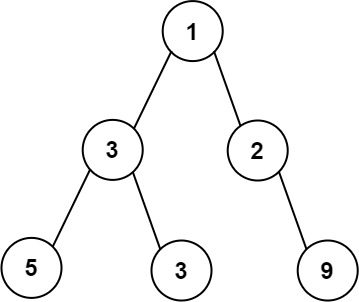

## 思路
<table>
<tr>
<td width="75%">

拿題目的圖片舉例。題目要找出哪一層的寬度最大，\
這裡的寬度是算從「最左的非空節點」到「最右的非空節點」的距離。\
以圖片來說，就是數字 5 到數字 9 之間的距離，一共是 4。\
看葉節點：這個距離從左到右分別是 $[5,3,\text{null},9]$ 。
</td>
<td valign="top">


</td>
</tr>
</table>

## 程式碼
### 1. 隊列
```cpp
class Solution {
public:
    int widthOfBinaryTree(TreeNode* root) {
        using ull = unsigned long long;
        queue<pair<TreeNode*, ull>> q; // {節點, 編號}
        q.push({root, 1});
        ull res = 0;
        while(!q.empty()) {
            int size = q.size();
            ull left = 0, right = 0;
            while(size--) {
                auto [cur, idx] = q.front();
                q.pop();
                if(cur->left) q.push({cur->left, idx * 2});
                if(cur->right) q.push({cur->right, idx * 2 + 1});
                if(left == 0) left = idx;
                right = idx;
            }
            res = max(res, right - left + 1);
        }
        return res;
    }
};
```
### 2. 陣列模擬隊列
```cpp
class Solution {
private:
    const int MX = 3000;
public:
    int widthOfBinaryTree(TreeNode* root) {
        using ull = unsigned long long;
        vector<pair<TreeNode*, ull>> q(MX + 1); // {節點, 編號}
        ull left = 0, right = 0;
        q[right++] = {root, 0};
        
        ull res = 0;
        while(left < right) {
            int size = right - left; // 左閉右開
            res = max(res, q[right - 1].second - q[left].second + 1);
            while(size--) {
                auto [cur, idx] = q[left++];
                if(cur->left) q[right++] = {cur->left, idx * 2};
                if(cur->right) q[right++] = {cur->right, idx * 2 + 1};
            }
        }
        return res;
    }
};
```
## 複雜度分析
- 時間複雜度：$O(n)$
- 空間複雜度：$O(n)$

