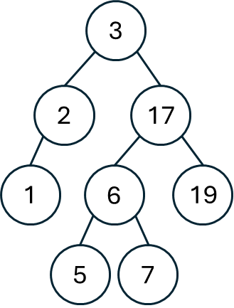

## 思路
<table>
<tr>
<td valign="top" width="80%">

給定一個二叉樹，以及一個數字範圍，將範圍以外的節點刪除。\
以右圖為例，現在只要留下範圍 $5\sim7$ 的搜索樹，\
從根結點開始遞迴：\
當前節點：`3`不在範圍內，而可能留下的部分只會在右樹，所以往右邊遞迴。\
當前節點：`17`也不在範圍內，可能留下的部分只會在左樹，往左遞迴。\
當前節點：`6`位於範圍內，不清楚左樹跟右樹會不會留下來，保留自己，往兩邊遞迴。
</td>
<td>


</td>
</tr>
</table>

## 程式碼
### 遞迴
```cpp
class Solution {
public:
    TreeNode* trimBST(TreeNode* root, int low, int high) {
        if(!root) return nullptr;
        if(root->val < low) { // 當前節點不合法, 只有右樹可能有範圍內的節點
            return trimBST(root->right, low, high);
        }   
        if(root->val > high) {
            return trimBST(root->left, low, high);
        }     
        // low <= root->val <= high
        // 當前節點合法，左右子樹不一定
        root->left = trimBST(root->left, low, high);
        root->right = trimBST(root->right, low, high);
        return root;
    }
};
```
## 複雜度分析
- 時間複雜度：$O(n)$
- 空間複雜度：$O(H)$, $H$為樹的高度

