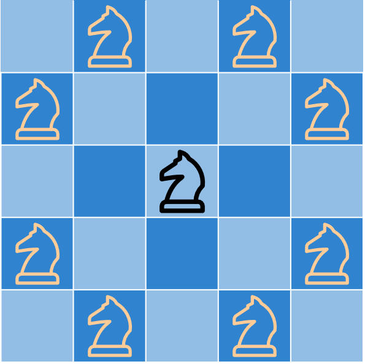

## 思路

<table>
<tr>
<td valign="top" width="77%">

問你一個騎士在棋盤上走`k`步後，還留在棋盤上的機率是多少。
定義`dp[step][x][y]`代表經過`step`步後，停留在位置`(x,y)`的機率是多少。
題目想要的答案，就相當於將`dp[k][0...n-1][0...n-1]`的數值加總，即為所求。

---

對於`dp[step][px][y]`來說，想要在第`step`步走到當前位置`(x,y)`，就得先在前面`step-1`步先走到自己附近八個格子上，並且在最後一步，以 $\frac18$ 的機率選到`(x,y)`作為下一個目的地。

</td>
<td>



<p style="text-align:center;">先花 step-1 步來到橘色區域，最後一步來到當前位置</p>

</td>
</tr>
</table>

### 1.記憶化搜索

```cpp
class Solution {
private:
    static const int MX = 26;
    static const int MXSTEP = 101;
    double dp[MXSTEP][MX][MX];
    const int dx[8] = {1, 1, -1, -1, 2, 2, -2, -2};
    const int dy[8] = {2, -2, 2, -2, 1, -1, 1, -1};
public:
    double knightProbability(int n, int k, int row, int column) {


        for(int i = 0; i <= k; i++) {
            for(int j = 0; j < n; j++) {
                for(int k = 0; k < n; k++) {
                    dp[i][j][k] = -1.0;
                }
            }
        }
        // 定義 dp[step][x][y] 代表經過 step 步後, 停留在位置 x, y 的機率是多少
        dp[0][row][column] = 1.0;

        auto dfs = [&](this auto&&dfs, int step, int x, int y) -> double {
            if(step == 0) {
                if(x == row && y == column) {
                    return 1.0;
                }
                else {
                    return 0.0;
                }
            }

            double& res = dp[step][x][y];
            if(res != -1) {
                return res;
            }

            res = 0.0;
            for(int i = 0; i < 8; i++) {
                int nx = x + dx[i];
                int ny = y + dy[i];
                if(nx < 0 || nx >= n || ny < 0 || ny >= n) continue;
                res += 0.125 * dfs(step - 1, nx, ny);
            }
            return res;
        };

        double res = 0;
        for(int i = 0; i < n; i++) {
            for(int j = 0; j < n; j++) {
                res += dfs(k, i, j);
            }
        }
        return res;
    }
};
```

### 2.遞推

```cpp
class Solution {
private:
    static const int MX = 26;
    static const int MXSTEP = 101;
    double dp[MXSTEP][MX][MX];
    const int dx[8] = {1, 1, -1, -1, 2, 2, -2, -2};
    const int dy[8] = {2, -2, 2, -2, 1, -1, 1, -1};
public:
    double knightProbability(int n, int k, int row, int column) {
        // 定義 dp[step][x][y] 代表經過 step 步後, 停留在位置 x, y 的機率是多少
        dp[0][row][column] = 1.0;
        for(int step = 1; step <= k; step++) {
            for(int x = 0; x < n; x++) {
                for(int y = 0; y < n; y++) {
                    double sum = 0;
                    for(int i = 0; i < 8; i++) {
                        int nx = x + dx[i];
                        int ny = y + dy[i];
                        if(nx < 0 || nx >= n || ny < 0 || ny >= n) continue;
                        sum += 0.125 * dp[step - 1][nx][ny];
                    }
                    dp[step][x][y] = sum;
                }
            }
        }
        double res = 0;
        for(int x = 0; x < n; x++) {
            for(int y = 0; y < n; y++) {
                res += dp[k][x][y];
            }
        }
        return res;
    }
};
```

### 3. 空間壓縮

空間壓縮可以做到只用一張二維表，但要釐清更新關係很麻煩，所以就只壓縮成了兩張二維表，空間複雜度是一樣的。

```cpp
class Solution {
private:
    static const int MX = 26;
    static const int MXSTEP = 101;
    double dp[2][MX][MX];
    const int dx[8] = {1, 1, -1, -1, 2, 2, -2, -2};
    const int dy[8] = {2, -2, 2, -2, 1, -1, 1, -1};
public:
    double knightProbability(int n, int k, int row, int column) {
        dp[0][row][column] = 1.0;
        for(int step = 1; step <= k; step++) {
            for(int x = 0; x < n; x++) {
                for(int y = 0; y < n; y++) {
                    double sum = 0;
                    for(int i = 0; i < 8; i++) {
                        int nx = x + dx[i];
                        int ny = y + dy[i];
                        if(nx < 0 || nx >= n || ny < 0 || ny >= n) continue;
                        sum += 0.125 * dp[0][nx][ny];
                    }
                    dp[1][x][y] = sum;
                }
            }
            swap(dp[0], dp[1]);
        }
        double res = 0;
        for(int x = 0; x < n; x++) {
            for(int y = 0; y < n; y++) {
                res += dp[0][x][y]; // 最後一次交換後，dp[0] 存著最後更新的答案
            }
        }
        return res;
    }
};
```

## 複雜度分析

- 時間複雜度：$O(mnk)$
- 空間複雜度：空間壓縮前 $O(mnk)$, 空間壓縮後 $O(mn)$
