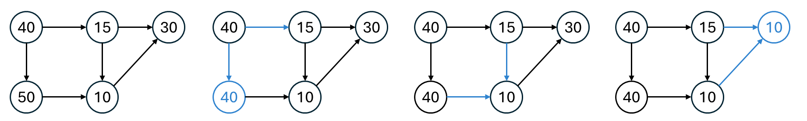

## 思路
- 對於每個人：找到比自己有錢，而且安靜值最低的人。

有錢的關係可以建立成一張圖，題目保證沒有循環，因此能利用拓樸排序，來找出這些人的富有關係。\
對於一個人來說，可能有很多個人都要比自己富有，在這些人當中，挑選安靜值最低的作為自己的答案。\
挑選安靜值的過程如下圖舉例所示。

<div style="text-align: center;"><span>安靜值的更新方式</span> </div>

在走訪鄰居時，自己要比鄰居富有，因此我所參考的對象，鄰居也能夠參考。\
用這個特性，更新鄰居的答案。

## 程式碼
### 1. 拓樸排續 鄰接表
```cpp
class Solution {
public:
    vector<int> loudAndRich(vector<vector<int>>& richer, vector<int>& quiet) {
        int n = quiet.size();
        vector<vector<int>> graph(n);
        vector<int> indegree(n);
        for(auto& v : richer) {
            graph[v[0]].push_back(v[1]);
            indegree[v[1]]++;
        }
        queue<int> q;
        for(int i = 0; i < n; i++) {
            if(indegree[i] == 0) {
                q.push(i);
            }
        }
        vector<int> res(n); // 紀錄答案, 存的是 index 
        ranges::iota(res, 0); // 初始化，自己所在的位置紀為答案
        while(!q.empty()) {
            int u = q.front(); q.pop();
            for(auto& v : graph[u]) {
                if(quiet[res[u]] < quiet[res[v]]) {
                    res[v] = res[u];
                }
                if(--indegree[v] == 0) {
                    q.push(v);
                }
            }
        }
        return res;
    }
};
```
### 2. 拓樸排續 鏈式前向星
```cpp
class Solution {
private:
    static const int MAXN = 501;
    static const int MAXM = 124751; // (500 * 499) / 2 + 1
    int head[MAXN];
    int next[MAXM];
    int to[MAXM];
    int cnt;
    int indegree[MAXN];
    int q[MAXN];
    void build(int n) {
        cnt = 0;
        fill(head, head + n, -1); // -1 代表沒有鄰居
        fill(indegree, indegree + n, 0);
    }
    void addEdge(int u, int v) {
        to[cnt] = v;
        next[cnt] = head[u];
        head[u] = cnt++;
    }
public:
    vector<int> loudAndRich(vector<vector<int>>& richer, vector<int>& quiet) {
        int n = quiet.size();
        build(n);
        for(auto& v : richer) {
            addEdge(v[0], v[1]);
            indegree[v[1]]++;
        }
        int l = 0, r = 0;
        for(int i = 0; i < n; i++) {
            if(indegree[i] == 0) {
                q[r++] = i;
            }
        }

        vector<int> res(n); // 紀錄答案, 存的是 index 
        iota(res.begin(), res.end(), 0); // 初始化，自己所在的位置紀為答案
        while(l < r) {
            int u = q[l++];
            int v;
            for(int ei = head[u]; ei >= 0; ei = next[ei]) { // 注意等號，這裡 ei = 0是合法的編號
                v = to[ei];
                if(quiet[res[v]] > quiet[res[u]]) { // u 比 v 有錢,因此 u 參考的答案, v 都能參考
                    res[v] = res[u];          
                }
                if(--indegree[v] == 0) {
                    q[r++] = v;
                }
            }
        }
        return res;
    }
};
```
## 複雜度分析
- 時間複雜度：$O(n+m)$
- 空間複雜度：$O(n+m)$

