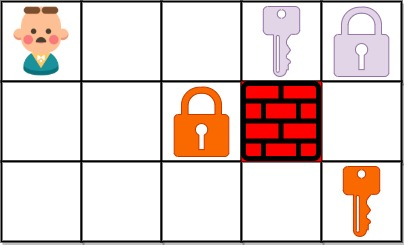

## 思路

<table>
<tr>
<td valign="top" width="70%">

根據題目敘述，要得知從左上角出發，取得所有鑰匙的最短路徑。\
在右圖的情況中，從起點拿到第一把鑰匙之後，選擇開鎖並去拿第二把鑰匙，總共花費 6 步。拿到第一把鑰匙之後，也可以選擇不開鎖，繞路去拿第二個鑰匙，但這樣花的步數就多了，不是最佳的走法。

</td>
<td>



</td>
</tr>
</table>

走到有鎖存在的點時，需要判斷過去有沒有拿到對應的鑰匙，才能知道當前能不能走這個格子。因此需要紀錄走到各格時，自己「<span style="color:var(--color-accent-fg)">鑰匙的擁有狀態</span>」為何，假如當前狀態是有鑰匙，那麼就能走鎖上的對應格子。\
因此，上面的例子中，我們不將一個格子視為一個節點，而是多個節點。具體如下：\
假設現在只有兩把鑰匙。

- `grid[x][y][00]`：位於座標 `(x,y)`，沒有取得任意鑰匙。
- `grid[x][y][01]`：位於座標 `(x,y)`，有取得第二把鑰匙。
- `grid[x][y][10]`：位於座標 `(x,y)`，有取得第一把鑰匙。
- `grid[x][y][11]`：位於座標 `(x,y)`，已經取得兩把鑰匙。

這就是所謂的擴點，或者叫分層圖。把<span style="color:var(--color-accent-fg)">實際位置與狀態結合</span>，看作是一個節點。

---

以下用 `bfs` 去解題。

1. 先遍歷一遍 `grid`，找到起點位置，並給所有存在的鑰匙給定一個 `id`，方便後續判斷。
2. 假設現在有六把鑰匙，那麼最初狀態是 `000000`，也就是一把鑰匙都沒有。
3. 取出隊列最前的節點，查看四方向的鄰居，根據鄰居是什麼而有不同狀態更新。
   - 牆壁：視為邊界，跳過。
   - 鎖頭：若當前沒有對應鑰匙，視為邊界，否則視為一般格子。
   - 鑰匙：更新狀態，將鑰匙對應的 `id` 位元標為 1。如果遇到 5 號鑰匙，狀態就是`X1XXXX`。

4. 重複第三步，直到遇到終點，或是隊列無元素存在為止。

## 程式碼

### 分層圖最短路徑

```cpp
class Solution {
private:
    static const int MX = 57601; // 30 * 30 * 2^6
    const int dir[5] = {-1, 0, 1, 0, -1};
    bool visited[30][30][64]{};

    char key[26]; // key['A'] = id
    int id = 0;

    using tiii = tuple<int, int, int>;
    tiii q[MX];
    int left = 0, right = 0; // queue 的雙指針

public:
    int shortestPathAllKeys(vector<string>& grid) {
        int m = grid.size();
        int n = grid[0].size();

        for(int i = 0; i < m; i++) {
            for(int j = 0; j < n; j++) {
                if(grid[i][j] == '@') {
                    q[right++] = make_tuple(i, j, 0); // queue 紀錄初始點位
                }
                else if(grid[i][j] != '.') {
                    if(isupper(grid[i][j])) {
                        key[grid[i][j] - 'A'] = id++;
                    }
                }
            }
        }

        int step = 0;
        while(left < right) {
            int size = right - left;
            while(size--) {
                auto [x, y, state] = q[left++];
                for(int i = 0; i < 4; i++) {
                    int nx = x + dir[i];
                    int ny = y + dir[i + 1];
                    if(nx < 0 || nx >= m || ny < 0 || ny >= n || grid[nx][ny] == '#' || visited[nx][ny][state]) continue;
                    int newState = state;
                    char c = grid[nx][ny];
                    if(isupper(c) && !(state & (1 << key[c - 'A']))) continue; // 遇到鎖，且打不開
                    if(islower(c)) newState = state | (1 << key[c - 'a']); // 遇到鑰匙，更新狀態
                    if(newState == (1 << id) - 1) return step + 1; // 更新後的狀態取得所有鑰匙，回傳步數
                    q[right++] = make_tuple(nx, ny, newState); // bfs 推入新狀態
                    visited[nx][ny][newState] = true;
                }
            }
            step++;
        }
        return -1;
    }
};
```

## 複雜度分析

- 時間複雜度：$O(mn \cdot 2^{k})$
- 空間複雜度：$O(mn \cdot 2^{k})$
