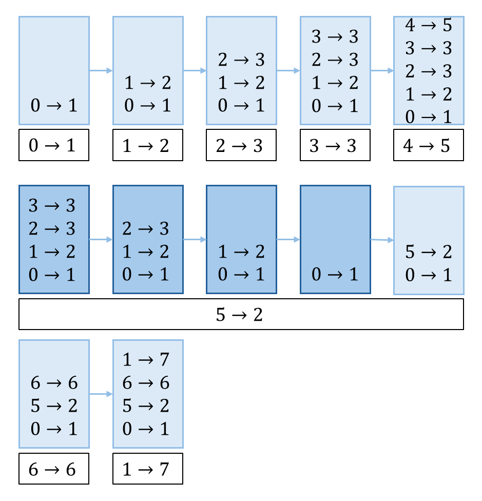

## 思路
枚舉所有子數組太慢了，把思路逆轉過來，去找最小值固定為某數的子數組有多少個。\
比如 $arr=[1,2,3,3,5,2,6,1]$ ，最小值為 $3$ 的子數組有
$$
[3],[3],[3,3],[3,5],[3,3,5]
$$
共五個，那麼對於答案的貢獻就是 $3\times{5}=15$ 。

---
<table>
<tr>
<td valign="top" width="65%">

就需要由 3 往左右兩邊擴張，找到以下兩個位置：
- 當前位置「左側小於自己，且距離最近數字」的位置`left`。
- 當前位置「右側小於自己，且距離最近數字」的位置`right`。\
這一步就用單調棧去做。
對於 $2\to3$ ：
- `left`是在彈出的時的棧頂元素 $1\to2$ 。
- `right`是將自己彈出的元素 $5\to2$ 。\
左邊可以選擇的起點有 $2-1=1$ 個（包含 3 本身）\
右邊可以選擇的結尾有 $5-2=3$ 個（包含 3 本身，分別是3, 3, 5）\
兩邊相乘，一共 3 個，對應到  $[3],[3,3],[3,3,5]$ 這三個子陣列。
</td>
<td>


</td>
</tr>
</table>

對於 $3\to3$ ：
- `left`是彈出時的棧頂元素 $2\to3$ 。
- `right`是將自己彈出的元素 $5\to2$ 。
左邊可以選擇的個數是 $3-2=1$ 個，只有 3 可選
右邊可以選擇的結尾一共有 $5-3=2$ 個，分別是 3, 5。
兩邊相乘，一共 2 個，對應到  $[3],[3,5]$ 這兩個子陣列。
## 程式碼
### 1. 單調棧
```cpp
class Solution {
private:
    const int MOD = 1e9 + 7;
    static const int MX = 30001;
    array<int, MX> stk; // 擺放的是位置
    array<array<int, 2>, MX> pos; // 紀錄左右距離自己最近的最小值的位置
public:
    int sumSubarrayMins(vector<int>& arr) {
        int n = arr.size();
        int j = -1; // 閉區間
        for(int i = 0; i < n; i++) {
            while(j >= 0 && arr[stk[j]] > arr[i]) {
                pos[stk[j]][1] = i; // 右邊比自己小的是現在的位置
                pos[stk[j]][0] = j - 1 >= 0 ? stk[j - 1] : -1; // 左邊是新的棧頂元素
                --j;
            }
            stk[++j] = i;
        }
        while(j >= 0) {
            pos[stk[j]][1] = n; // 右邊是 n, 代表沒有比較小的, 後續計算用
            pos[stk[j]][0] = j - 1 >= 0 ? stk[j - 1] : -1;
            --j;
        }
        // 不需要調整右側，因為相同數值會被壓入棧，結算時獨立運算
        long long res = 0;
        for(int i = 0; i < n; i++) { // 算答案的部分可以跟上面的迴圈合併
            long long add = (long long)arr[i] * (i - pos[i][0]) * (pos[i][1] - i);
            // printf("left = %d, right = %d, ", pos[i][0], pos[i][1]);
            // printf("add: %d * %d * %d = %d\n", arr[i], i - pos[i][0], pos[i][1] - i, add);
            res += add; // 開區間
            res %= MOD;
        }
        return res;
    }
};
```
### 2. 單調棧 合併結算
```cpp
class Solution {
private:
    const int MOD = 1e9 + 7;
    static const int MX = 30001;
    array<int, MX> stk; // 擺放的是位置
    array<array<int, 2>, MX> pos; // 紀錄左右距離自己最近的最小值的位置
public:
    int sumSubarrayMins(vector<int>& arr) {
        int n = arr.size();
        int j = -1; // 閉區間
        long long res = 0;
        for(int i = 0; i < n; i++) {
            while(j >= 0 && arr[stk[j]] > arr[i]) {
                int right = i; // 右邊比自己小的是現在的位置
                int left = j - 1 >= 0 ? stk[j - 1] : -1; // 左邊是新的棧頂元素
                // 結算的是當前的棧頂元素
                res += (long long)arr[stk[j]] * (stk[j] - left) * (right - stk[j]);
                res %= MOD;
                --j;
            }
            stk[++j] = i;
        }
        while(j >= 0) {
            int right = n; // 右邊是 n, 代表沒有比較小的, 後續計算用
            int left = j - 1 >= 0 ? stk[j - 1] : -1;
            res += (long long)arr[stk[j]] * (stk[j] - left) * (right - stk[j]);
            res %= MOD;
            --j;
        }
        return res;
    }
};
```
## 複雜度分析
- 時間複雜度：$O(n)$
- 空間複雜度：$O(n)$

