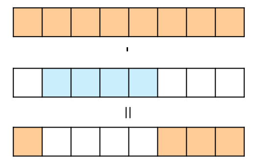

## 思路

<table>
<tr>
<td valign="top" width="70%">

相比[[53]]，多了「環形」的條件，也就是首尾相連。

首尾相連的數組要找最大，相當於找「最小的子數組」，並將總和扣除這個子數組，就能將首尾相連的環形數組一併考慮進來。

</td>
<td>



</td>
</tr>
</table>

---

寫的過程要注意，當「最小的子數組」總和等於數組本身總和時，對應的是空數組，需要特別判斷。

```cpp title="空間壓縮"
class Solution {
public:
    int maxSubarraySumCircular(vector<int>& nums) {
        int n = nums.size();
        int sum = nums[0]; // 整體和
        int curMaxSum = nums[0], maxSum = nums[0];
        int curMinSum = nums[0], minSum = nums[0];
        for(int i = 1; i < n; i++) {
            sum += nums[i];
            curMaxSum = max(nums[i], curMaxSum + nums[i]); // 另起爐灶, 或是接續前面
            maxSum = max(maxSum, curMaxSum);
            curMinSum = min(nums[i], curMinSum + nums[i]); // 另起爐灶, 或是接續前面
            minSum = min(minSum, curMinSum);
        }
        return sum == minSum ? maxSum : max(maxSum, sum - minSum); // minSum == sum 相當於什麼都不選
    }
};
```

## 程式碼

### 1.

```cpp

```

### 2.

```cpp

```

## 複雜度分析

- 時間複雜度：$O()$
- 空間複雜度：$O()$
