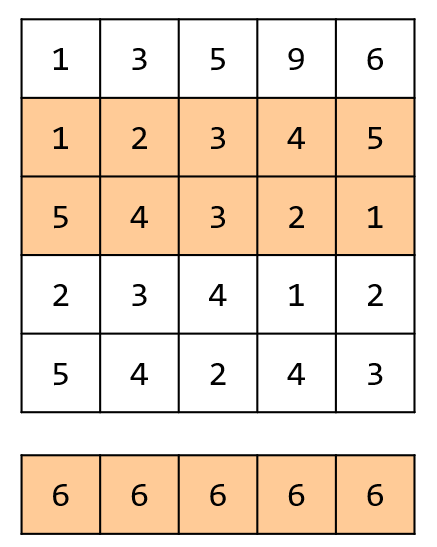

## 思路

把大問題先拆成一系列的子問題。現在要找在矩陣中隨便框一個區塊，數值總和最大的區塊。
一時很難想到「隨便框」該怎麼做，那就分情況討論。

1. 必須選擇第 1 列，且僅包含第 1 列。`matrix[0...0][0...n-1]`
2. 必須選擇 1, 2 列，且僅包含 1, 2 列。`matrix[0...1][0...n-1]`
3. 必須選擇 1, 2, 3 列，且僅包含 1, 2, 3 列。`matrix[0...2][0...n-1]`
4. 必須選擇 1, 2, 3, 4，且僅包含 1, 2, 3, 4 列。`matrix[0...3][0...n-1]`

---

5. 必須選擇第 2 列，且僅包含第 2 列。`matrix[1...1][0...n-1]`
6. 必須選擇 2, 3 列，且僅包含 2, 3 列。`matrix[1...2][0...n-1]`
7. 必須選擇 2, 3, 4 列，且僅包含 2, 3, 4 列。`matrix[1...3][0...n-1]`

---

<table>
<tr>
<td valign="top" width="75%">

8. 必須選擇第 3 列，且僅包含第 3 列。`matrix[2...2][0...n-1]`
9. 必須選擇 3, 4 列，且僅包含 3, 4 列。`matrix[2...3][0...n-1]`

$\cdots$

既然每次都必定選擇某幾列的數值，那就是先將這些數字都合併在一起，\
然後按照第一題的作法找到當前限制下的解答。

比如每次必須選擇 2, 3, 列，對應到合併後的一維陣列。\
就如右圖下方的表格一樣。

</td>
<td>



</td>
</tr>
</table>

## 程式碼

```cpp title="枚舉上下界"
class Solution {
public:
    vector<int> getMaxMatrix(vector<vector<int>>& matrix) {
        int m = matrix.size();
        int n = matrix[0].size();

        vector<int> nums(n);
        int res = INT_MIN;
        int x1, x2, y1, y2;
        x1 = x2 = y1 = y2 = 0;
        int maxArea = 1;
        for(int top = 0; top < m; top++) {
            fill(nums.begin(), nums.end(), 0);
            for(int bottom = top; bottom < m; bottom++) {
                int last = INT_MIN;
                int tempRes = last;
                int l, r, left, right;
                l = r = left = right = 0;
                for(int j = 0; j < n; j++) {
                    nums[j] += matrix[bottom][j]; // 計算此次總合
                    if(last > 0) {
                        last += nums[j];
                        r = j;
                    }
                    else {
                        last = nums[j];
                        l = r = j;
                    }
                    if(last >= tempRes) {
                        tempRes = last;
                        left = l;
                        right = r;
                    }
                }

                if(tempRes > res) {
                    res = tempRes;
                    x1 = left;
                    y1 = top;
                    x2 = right;
                    y2 = bottom;
                }
            }
        }
        return {y1, x1, y2, x2};
    }
};
```

## 複雜度分析

- 時間複雜度：$O(nm^2)$
- 空間複雜度：$O(n)$
