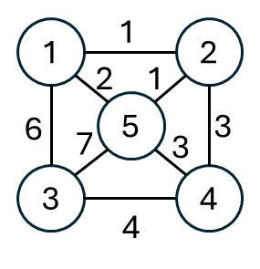

## 1. Kruskal 方法
 $E$ 代表邊的個數
1. 選擇最小權重的邊 (可排可不排，不排就要靠遍歷找最小值) 。 $O(|E|\log{|E|})$ 
2. 如果不會形成環, 就選擇, 並加入生成樹當中。 $O(|E|\alpha(|E|,|V|))$ 
3. 直到有 $n-1$ 個邊（一共 $n$ 個點, 沒有環），否則執行第二步。 
難點在於判斷有沒有形成環。
因此建立 MST 需要有兩個功能, 來幫助上面的演算法
- 找到最小的權重：可以事先排序, 或是直接找， $O(n)~\text{vs}~O(n\log{n})$ 。
- 檢查環：用並查集判斷節點是否已經相連。

--- 

<table>
<tr>
<td valign="top" width="77%">

以右圖為例，最初一共有八條邊，權重： $\{1,1,2,3,3,4,6,7\}$ 
1. 取得權重最小的邊 1，連接結點 1, 2
    - 並查集： $\{1,2\}\{3\}\{4\}\{5\}$ 
    - 待選擇的邊： $\{1,2,3,3,4,6,7\}$ 
</td>
<td>


</td>
</tr>
</table>

2. 取得權重最小的邊 1，連接節點 2, 5。
    - 並查集： $\{1,2,5\}\{3\}\{4\}$ 
    - 待選擇的邊： $\{2,3,3,4,6,7\}$ 
3. 取得權重最小的邊 2，發現 1, 5 已經在相同集合，會形成環，代表這個邊不會連到新的節點，不選這個邊。
    - 並查集： $\{1,2,5\}\{3\}\{4\}$ 
    - 待選擇的邊： $\{3,3,4,6,7\}$ 
4. 取得權重最小的邊 3，連接節點 2, 4（依照排序的結果，也有可能是 5, 4 那條）。
    - 並查集： $\{1,2,4,5\}\{3\}$ 
    - 待選擇的邊： $\{3,4,6,7\}$ 
5. 取得權重最小的邊 3，發現 4, 5 已經在相同集合，不選這個邊。
    - 並查集： $\{1,2,4,5\}\{3\}$ 
    - 待選擇的邊： $\{4,6,7\}$ 
6. 取得權重最小的邊 4，連接節點 3, 4。
    - 並查集： $\{1,2,3,4,5\}$ 
    - 待選擇的邊： $\{4,6,7\}$ 
已經找到 $n-1$ 條邊，結束，總權重是 $1+1+3+4=9$ 。
### 程式碼
```cpp
#include <iostream>
#include <numeric>
#include <algorithm>
using namespace std;
const int MAXN = 5005;
const int MAXM = 2e5+5;
struct Edge {
    int u, v, w;
    bool operator<(const Edge& other) {
        return this->w < other.w;
    }
};
int parent[MAXN];
Edge edges[MAXM];
int find(int x) {
    if(parent[x] != x) {
        parent[x] = find(parent[x]);
    }
    return parent[x];
}
int main(void) {
    ios::sync_with_stdio(false);
    cin.tie(nullptr);
    int n, m;
    cin >> n >> m;
    iota(parent, parent + n + 1, 0); // 節點編號 1 ~ n
    for(int i = 0; i < m; i++) {
        cin >> edges[i].u >> edges[i].v >> edges[i].w;
    }
    sort(edges, edges + m); // 根據權重排序，小到大
    int res = 0, cnt = 0;
    for(int i = 0; i < m; i++) {
        int rootU = find(edges[i].u);
        int rootV = find(edges[i].v);
        if(rootU != rootV) { // 只有在集合不同時，才去合併
            parent[rootU] = rootV;
            res += edges[i].w;
            if(++cnt == n - 1) { // 已經湊到 n - 1 條邊，已經找到最小生成樹
                cout << res;
                return 0;
            }
        }
    }
    cout << "orz"; // 無法找到最小生成樹
}
```
## 2. Prim 方法
從一個點開始，慢慢地往外生長
1. 建兩個集合， $A$ 代表被生成樹碰到的頂點， $B$ 表示沒被碰到的。
2. 每次從 $A$ 選擇一個頂點 $u$ ，從 $B$ 選擇一個頂點 $v$ ，且這兩點是所有可選擇的配對方案中，權重最小的一對點。
3.  $A$ 加入頂點 $v$ ， $B$ 移除頂點 $v$ ，也就是把頂點 $v$ 移動到  $A$ 中。
4. 重複直到 $B$ 為空。
### 程式碼
```cpp
#include <iostream>
#include <queue>
using namespace std;
#define pii pair<int,int>
const int MAXN = 5001;
const int MAXM = 4e5+1; // 雙向邊最多的數量
// 鏈式前向星
int head[MAXN];
int Next[MAXM];
int to[MAXM];
int weight[MAXM];
int id = 1;
// 判斷哪些邊已經觸碰到
bool used[MAXN];
void build(int n) {
    fill(head, head + n + 1, 0);
    id = 1;
    fill(used, used + n + 1, false);
}
void addEdge(int u, int v, int w) {
    Next[id] = head[u];
    to[id] = v;
    weight[id] = w;
    head[u] = id++;
}
int main(void) {
    ios::sync_with_stdio(false);
    cin.tie(nullptr);
    int n, m, x, y, z;
    cin >> n >> m;
    build(n);
    for(int i = 0; i < m; i++) {
        cin >> x >> y >> z;
        addEdge(x, y, z);
        addEdge(y, x, z);
    }
    priority_queue<pii, vector<pii>, greater<pii>> pq; // 存放權重, 鄰居
    for(int ei = head[1]; ei > 0; ei = Next[ei]) {
        pq.push({weight[ei], to[ei]});
    }
    used[1] = true;
    int cnt = 1; // 當前觸碰到的點數量
    int cost = 0;
    while(!pq.empty()) {
        pii cur = pq.top(); pq.pop();
        if(!used[cur.second]) {// 沒有觸碰過這個節點
            used[cur.second] = true;
            cnt++;
            cost += cur.first;
            for(int ei = head[cur.second]; ei > 0; ei = Next[ei]) { // 加入新的邊
                pq.push({weight[ei], to[ei]});
            }
            if(cnt == n) {
                break;
            }
        }
    }
    if(cnt != n) {
        cout << "orz";
    }
    else {
        cout << cost; 
    }
}
```
## 3. Prim 方法的優化
Prim 的複雜度跟 Kruskal 是一樣的，大多時間都用 Kruskal 就夠了。\
不過 Prim 方法可以優化複雜度，原先是 $O(m\times\log{m})+O(n)+O(m)$ \
可以改為 $O(n+m)+O((m+n)\times\log{n})$ 。

---

前面的作法，是在堆中選出權重最小的邊，將連到的點加入。\
複雜度取決於邊的數量，而改進的算法則取決於點的數量，在點少邊多的情況下，優化過後的算法能表現得更好。\
而現在只能跟圖上的節點數量有關，希望能讓每個節點都只會進出堆中一次。\
對於一個點來說，它只會有三種情況：
1. 從未進入過堆中，代表沒有被算過，將新的邊加入堆中。
2. 正在堆當中，代表正在更新中，如果新來的邊比較小，更新堆中元素。
3. 已經進入堆，且不在堆當中，代表更新完畢，後續相關的邊就直接忽略。

這時，我們假設節點 $x$ 有來到鄰居 $a,b$ 的兩條路徑，分屬不同的情況。
- 其中 $a$ 屬於情況三，已經進入堆，且不在堆當中。已經被更新完畢，那麼這條 $x\to a$ 的路徑，就不需要考慮在內。
- 而 $b$ 屬於情況二，正在堆中，代表更新中。這條 $x\overset{5}\to{b}$ 的路徑應該要被考慮在內。\
  於是我們更新堆中的資料，若此時堆中的資料是 $\{b,100\}$ ，\
  代表來到 $b$ 節點的路徑當前是 100，\
  那麼，就可以用這條新的路徑取代，\
  也就是將堆中的資料，從 $\{b,100\}$ 更改為 $\{b,5\}$ 。\
  但是，堆在調整時，對應的元素會調整位置，\
  如果想要做到上述的修改。我們就得時時知道 $b$ 位於堆的哪個位置。

在情況二當中，我們需要知道堆中元素的位置，因此需要建立一個反向索引表where用來記錄。
1. 最初隨便選一個節點，將相關的邊加入到堆中。
2. 彈出最小堆中的節點，紀錄答案，並將相關的邊，用於更新堆中元素。
  - 判斷前述的三種情況。
3. 重複步驟二，直到最小堆為空。
### 程式碼
```cpp
#include <iostream>
using namespace std;
const int MAXN = 5002;
const int MAXM = 4e5+2;

// 題目輸入
int n, m, x, y, z;

// 鏈式前向星
int head[MAXN];
int Next[MAXM];
int to[MAXM];
int weight[MAXM];
int id = 1;

// 小根堆
int heap[MAXN][2]; // 每個節點的紀錄最多進入一次，出去一次。
int where[MAXN]; // 紀錄節點在 heap 的位置。-2代表已經出去過，-1代表新節點
int heapSize; // 當前堆的大小

void build() {
    // 鏈式前向星初始化
    fill(head, head + n + 1, 0);
    id = 1;
    // 堆相關的反向索引表初始化
    fill(where, where + n + 1, -1);
    heapSize = 0;
}
// 鏈式前向星的相關函數
void addEdge(int u, int v, int w) {
    to[id] = v;
    weight[id] = w;
    Next[id] = head[u];
    head[u] = id++;
}

// 堆調整相關函數
void heapSwap(int i, int j) {
    swap(where[heap[i][0]], where[heap[j][0]]);
    swap(heap[i], heap[j]);
}
bool isEmpty() {
    return heapSize == 0;
}
// 向上調整
void heapInsert(int i) {
    while(heap[i][1] < heap[(i - 1) / 2][1]) {
        heapSwap(i, (i - 1) / 2);
        i = (i - 1) / 2;
    }
}
// 向下調整
void heapify(int i) {
    int l = i * 2 + 1;
    while(l < heapSize) {
        int best = l + 1 < heapSize && heap[l + 1][1] < heap[l][1] ? l + 1 : l;
        // 如果當前節點已經比最小的孩子還小（或相等），說明調整完畢
        if(heap[i][1] <= heap[best][1]) {
            break;
        }
        heapSwap(i, best);
        i = best;
        l = i * 2 + 1;
    }
}
// 丟掉最小節點
void pop() {
    int v = heap[0][0]; // 存頂端節點
    heapSwap(0, --heapSize); // 拿尾端補頂端
    heapify(0);
    where[v] = -2; // 標記為已經出過 heap
}
// 當前處理的是編號為 ei 的邊
void addOrUpdateOrIgnore(int ei) {
    int v = to[ei];
    int w = weight[ei];
    if(where[v] == -1) { // 沒有進入過，就進入
        heap[heapSize][0] = v;
        heap[heapSize][1] = w;
        where[v] = heapSize++;
        heapInsert(where[v]); // 調整這個位置的數值
    }
    else if(where[v] >= 0) { // 位於堆中
        if(heap[where[v]][1] > w) { // 更新數值
            heap[where[v]][1] = w;
            heapInsert(where[v]); // 向上調整
        }
    }
}
int main(void) {
    ios::sync_with_stdio(false);
    cin.tie(nullptr);
    cin >> n >> m;
    build();
    for(int i = 0; i < m; i++) {
        cin >> x >> y >> z;
        addEdge(x, y, z);
        addEdge(y, x, z);
    }
    
    int nodeCnt = 1; // 當前觸碰到的點數量
    int cost = 0;
    where[1] = -2; // 節點 1 視為已經彈出，如果在下方迴圈之後設，遇到自環，where 的判斷會有問題
    for(int ei = head[1]; ei > 0; ei = Next[ei]) { // 將第一個點能接觸到的鄰居放入 heap, 作為初始狀態
        addOrUpdateOrIgnore(ei);
    }

    while(!isEmpty()) {
        int v = heap[0][0];
        int w = heap[0][1];
        pop();
        cost += w;
        nodeCnt++;
        for(int ei = head[v]; ei > 0; ei = Next[ei]) {
            addOrUpdateOrIgnore(ei);
        }
    }
    if(nodeCnt != n) {
        cout << "orz";
    }
    else {
        cout << cost; 
    }
}
```
## 複雜度分析
- 時間複雜度：Kruskal，Prim $O(m\log{m})$，Prim 優化 $O(m\log{n})$
- 空間複雜度：$O(n + m)$
