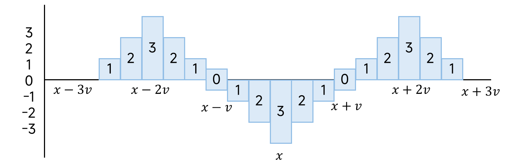

小貼士：前置題目 [P4231 三步必殺](./p4231-三步必殺)
## 思路
現在有個人跳水，跳的地方的水位會下降相當於這個人的體積，另外，會濺起一大堆水花，讓周圍的水位也一併變動，每隔一個單位就差一，下圖是體積三的落水造成的變化。

現在有一堆人跳水，請問在所有人跳完水之後，最後的水位長什麼樣子？
1. 需要開足夠大的陣列，讓跳水的波紋不要越界，方面後續判斷。
2. 上圖跳水產生的影響可以看成四個「等差數列差分數組」的問題。
3. 最後輸出時注意範圍。
## 程式碼
### 差分數組
```cpp
// P5026 Lycanthropy
#include <iostream>
using namespace std;
const int MX = 1e6 + 1; 
const int OFFSET = 3e4 + 1; // 避免 v 越界判斷
long long diff[OFFSET + MX + OFFSET]{}; // 跳水的點如果在最左或是最右，延伸的波紋額外擴散 OFFSET
void set(int l, int r, int s, int e, int d) {
    diff[l] += s;
    diff[l + 1] += d - s;
    diff[r + 1] -= d + e;
    diff[r + 2] += e;
}
void build(int m) {
    for(int i = 1; i <= m + OFFSET; ++i) { // 從最一開始計算到最右邊的波紋
        diff[i] += diff[i - 1];
    }
    for(int i = 1; i <= m + OFFSET; ++i) {
        diff[i] += diff[i - 1];
    }
}
int main(void) {
    int n, m, v, x; // 1e6, 1e6, 1e4, 1e6
    cin >> n >> m;
    for(int i = 0; i < n; ++i) {
        cin >> v >> x; // 體積, 落水點 i 
        x += OFFSET; // 落水點加入偏移量
        set(x-3*v+1, x-2*v, 1, v, 1);
        set(x-2*v+1, x, v-1, -v, -1);
        set(x+1, x+2*v, -v+1, v, 1);
        set(x+2*v+1, x+3*v-1, v-1, 1, -1);
    }
    build(m);
    for(int i = OFFSET + 1; i <= OFFSET + m; ++i) { // 輸出時從 1 開始，並加入偏移量。
        cout << diff[i] << (i == OFFSET + m ? "" : " ");
    }
    cout << endl;
}
```
## 複雜度分析
- 時間複雜度：$O(n + m + \text{OFFSET})$
- 空間複雜度：$O(m + \text{OFFSET})$
