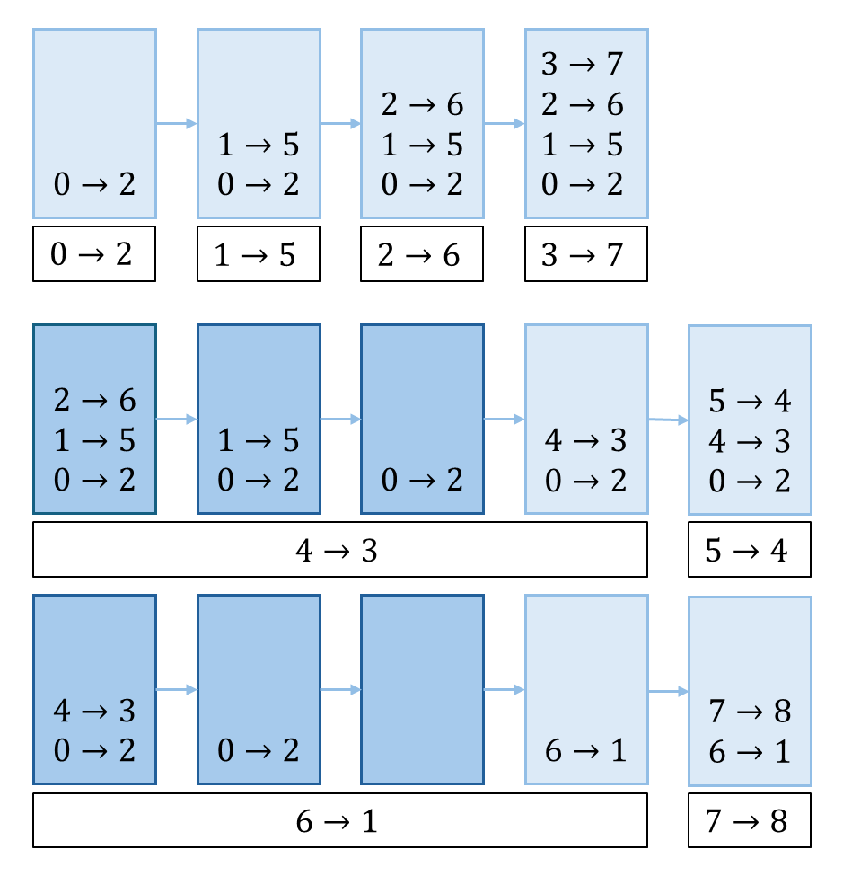

## 思路
單調棧，要求棧裡面的數值具有單調性。\
最經典的用法是解決如下問題：\
每個位置都求：
1. 當前位置「左邊比自己小，且距離最近數字」的位置。
2. 當前位置「右邊比自己小，且距離最近數字」的位置。\
或
3. 當前位置「左側比自己大，且距離最近數字」的位置。
4. 當前位置「右側比自己大，且距離最近數字」的位置。

用單調棧的方式可以做到求解過程中，單調棧所有調整的代價 $O(n)$ ，單次操作平均 $O(1)$

---
<table>
<tr>
<td valign="top" width="62%">

假設現在想要找到前兩個情況的數值。給定數組 $[2,5,6,7,3,4,1,8]$
單調棧的變化如右圖，初始化單調棧`stk = []`，裡面放著數字對應的下標，數值需要嚴格遞增

前四個數字，棧頂元素對應的數值都比自己小，所以能直接放入。

此時，棧頂元素就是「左邊比自己小，且距離最近數字」的位置

第五個數字放入時，棧頂元素比自己大，為了保持單調遞增，將比自己大的元素清除。

清除時，對於棧頂元素來說，當前的數字就是「右邊比自己小，且距離最近數字」的位置。

最後棧中留下的數字，右邊不存在比自己小的數字。
</td>
<td>


</td>
</tr>
</table>

為了一致，統一在元素彈出棧的時候結算答案：
- 讓自己彈出的元素是「右邊比自己小，且距離最近數字」的位置。
- 彈出之後留在棧頂的元素是「左邊比自己小，且距離最近數字」的位置。

為什麼一定會是「距離最近」的呢？\
假設現在的陣列是 $[3\dots7]$ ，且棧中 7 壓著 3，兩個條件成立時，那麼 3 一定就是距離最近，比 7 小的數字。\
兩數之間，會有小於或大於 3 的數字（假設無重複數字），
- 如果有小於 3 的數字 2，對於 7 來說答案應該是 2，但是這樣會把 3 彈出，最後棧中不會是 7 壓 3。
- 如果有比較大的數字 5 在兩者之間，最後棧也不會是 7 壓 3，而是有 5 在中間。
所以，在兩個條件成立時，3 一定就是距離最近，比 7 小的數字。

---

在有重複數字的數組當中，比如 $[3,3,3,1]$ ，按照之前的作法，前面兩個 3，會認為比自己小的數字是自己右邊一個位置的 3。但實際上都是最右邊的 1，為了解決這個問題，倒序遍歷。
- 倒數第一個 3，紀錄比自己小的數字是最後一個 1，紀錄正確。
- 倒數第二個 3，紀錄的數字是倒數第一個 3，跟自己一樣大，紀錄不正確，拿倒數第一個 3 的紀錄，變成最後一個 1。
- 倒數第三個 3，紀錄的數字是倒數第二個 3，跟自己一樣大，紀錄不正確，拿倒數第三個 3 的紀錄，變成最後一個 1。
如此一來，就能將正確的答案一路往前傳遞。

## 程式碼
### 單調棧
```cpp
#include <iostream>
#include <array>
#include <stack>
using namespace std;
const int MX = 1e6+1;
array<int, MX> nums, stk;
array<array<int, 2>, MX> res; // 0 紀錄左邊，1 紀錄右邊 
int main() {
    ios::sync_with_stdio(false);
    cin.tie(nullptr);
    int n;
    cin >> n;
    int top = -1; // 當前棧頂對應的位置
    for(int i = 0; i < n; i++) {
        cin >> nums[i];
        while(top >= 0 && nums[stk[top]] >= nums[i]) {
            // 彈出的位置更新左右
            res[stk[top]][1] = i; // 右邊比自己小的數字是輸入的下標
            res[stk[top]][0] = top - 1 >= 0 ? stk[top - 1] : -1; // 左邊比自己小的數字是新的棧頂
            --top;
        }
        stk[++top] = i; // 推入新數字的位置
    }
    // 將最後留在棧的數字 pop 掉，結算剩下的數字
    while(top >= 0) {
        res[stk[top]][1] = -1;
        res[stk[top]][0] = top - 1 >= 0 ? stk[top - 1] : -1;
        --top;
    }

    // 修正重複數字，導致右側記錄跟自己一樣大的數字的問題
    for(int i = n - 1; i >= 0; i--) {
        if(nums[i] == nums[res[i][1]]) { // 當前數字右側紀錄對應的數值，跟自己一樣大
            res[i][1] = res[res[i][1]][1]; // 右側紀錄更新，更新為「右側紀錄對應的數值」的右側紀錄
        }
    }
    for(int i = 0; i < n; i++) {
        cout << res[i][0] << " " << res[i][1] << "\n";
    }
}
```
## 複雜度分析
- 時間複雜度：$O(n)$
- 空間複雜度：$O(n)$
