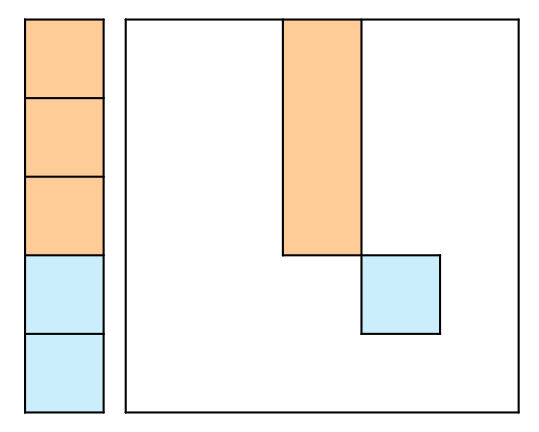

## 思路

從暴力遞迴開始。定義`dfs(i,j)`代表節點數為`i`且高度不大於`j`的二叉樹個數。\
一顆樹能分為根結點、左樹、右樹三種情況，因此遞迴呼叫也是如此。

> 這裡就直接加入記憶化搜索了，相信讀者已經熟悉了。

1. 一個節點用作根結點，給左樹分配x個節點，給右樹分配`i-x-1`個節點，高度至多`j-1`。
2. 嘗試所有可能的`x`，把這些可能性都相加，便能得到答案。

- 如果節點數為 0，只有一種空樹的情況，因此返回 1。
- 如果節點數 > 0, 但要求高度不超過 0，沒有這種情況，返回 0。

```cpp title="記憶化搜索"
#include <iostream>
using namespace std;
const int MOD = 1e9+7;
const int MX = 51;
int dp[MX][MX];

int dfs(int n, int m) {
    if(n == 0) return 1;
    if(m == 0) return 0; // n > 0
    if(dp[n][m] != -1) return dp[n][m];
    long long res = 0;
    for(int k = 0; k < n; k++) {
        res = (res + 1LL * dfs(k, m - 1) * dfs(n - k - 1, m - 1) % MOD) % MOD;
    }
    dp[n][m] = res;
    return dp[n][m];
}

int main(void) {
    int n, m;
    cin >> n >> m;
    for(int i = 0; i <= n; i++) {
        fill(dp[i], dp[i] + m + 1, -1);
    }
    cout << dfs(n, m);
}
```

接下來轉換成遞推，想要知道`dp[n][m]`，得先知道`dp[0...n][m-1]`，也就是上一行的數值。

- 計算`dp[5][10]`，要先知道`dp[0...5][9]`的所有數值。
- 計算`dp[4][10]`，要先知道`dp[0...4][9]`的所有數值。
- ...

自左而右，自上而下遍歷，能確保當前計算格子的數值都已經計算好，所以不需要特別做轉換。

```cpp title="遞推"
#include <iostream>
using namespace std;
const int MOD = 1e9+7;
const int MX = 51;
int dp[MX][MX];

int main(void) {
    int n, m;
    cin >> n >> m;
    fill(dp[0], dp[0] + m + 1, 1); // 第一列, dp[0][x] = 1
    for(int i = 1; i <= n; i++) {  // 第一行, dp[x][0] = 0
        dp[i][0] = 0;
    }
    for(int i = 1; i <= n; i++) {
        for(int j = 1; j <= m; j++) {
            long long res = 0;
            for(int k = 0; k < i; k++) {
                res = (res + 1LL * dp[k][j - 1] * dp[i - k - 1][j - 1] % MOD) % MOD;
            }
            dp[i][j] = res;
        }
    }
    cout << dp[n][m];
}
```

<table>
<tr>
<td valign="top" width="80%">

最後做空間壓縮，想更新藍色格子時，需要參照橘色部分的數值，因此更新是自後往前。\
在一維`dp`表中，藍色代表新值，橘色代表舊值。\
更新時自下往上，自左而右，便能正確更新完`dp`表。

</td>
<td>



</td>
</tr>
</table>

```cpp title="空間壓縮"
#include <iostream>
using namespace std;
const int MOD = 1e9+7;
const int MX = 51;
int dp[MX];

int main(void) {
    int n, m;
    cin >> n >> m;
    fill(dp, dp + n + 1, 0);
    dp[0] = 1;
    for(int j = 1; j <= m; j++) {
        for(int i = n; i > 0; i--) {
            long long res = 0;
            for(int k = 0; k < i; k++) {
                res = (res + 1LL * dp[k] * dp[i - k - 1] % MOD) % MOD;
            }
            dp[i] = res;
        }
    }
    cout << dp[n];
}
```

## 複雜度分析

- 時間複雜度：$O(mn)$
- 空間複雜度：空間壓縮前 $O(mn)$, 壓縮後 $O(n)$
